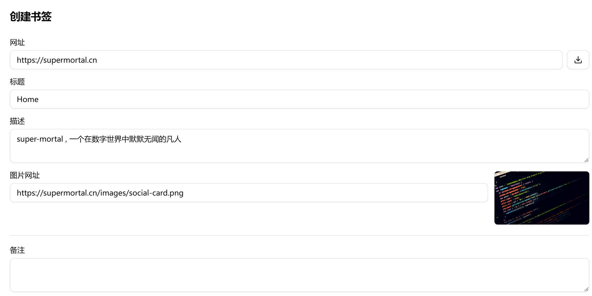
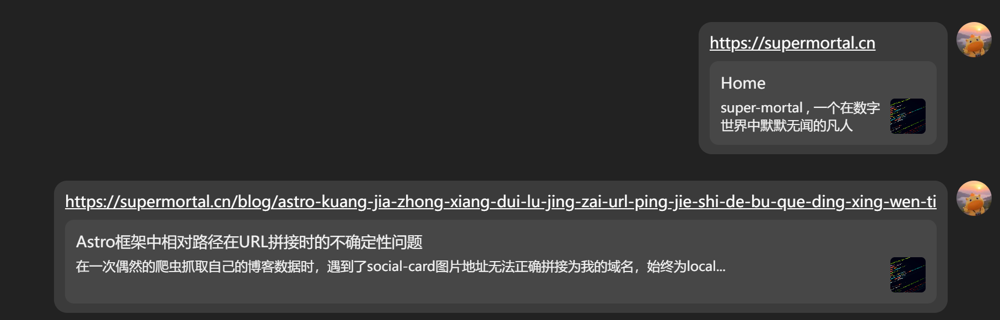

## 一.问题发现

偶然之间，我发现网络爬虫在抓取我的博客页面时，生成的 Open Graph (OG) 图片地址显示为：

```markdown
https://localhost/images/social-card.png

# 而不是https://supermortal.cn/images/social-card.png，导致图片无法显示，下图为修复之后的截图
```



## 二.问题排查过程

### 第一步：检查配置文件

首先，我检查了项目中的所有配置文件：

1. **`astro.config.ts`**（第 28 行）：

```typescript
site: 'https://supermortal.cn',
```

这里已经正确配置了正式域名

2. **`src/site.config.ts`**（第 14 行）：

```typescript
socialCard: '/images/social-card.png',
```

这里使用的是相对路径

### 第二步：分析代码逻辑

在 `src/components/BaseHead.astro` 中，找到生成 meta 标签的关键代码（第 14 行）：

```typescript
const socialImageURL = new URL(ogImage ? ogImage : config.socialCard, Astro.url).href
```

这里的问题是使用了 `new URL(..., Astro.url)` 方法。

### 第三步：理解关键概念

1. 我意识到这里涉及两个不同的 URL：

- **`astro.config.ts` 的 `site` 配置**：定义网站在互联网上的正式域名（用于 RSS、sitemap 等元数据）
- **`Astro.url`**：在运行时由框架根据浏览器实际请求的 URL 提供的当前请求地址

2. 在开发环境中，浏览器请求 `http://localhost:3000/`，所以 `Astro.url` 就是 `http://localhost:3000`。
3. 但是网络爬虫的工作环境可能与本地浏览器不同，在某些情况下，`Astro.url` 可能被错误识别为 `https://localhost`

### 第四步：URL 拼接验证

当使用 `new URL('/images/social-card.png', Astro.url)` 时：

- 如果 `Astro.url` 是 `http://localhost`，结果就是 `http://localhost/images/social-card.png`
- 如果 `Astro.url` 是 `https://supermortal.cn`，结果就是 `https://supermortal.cn/images/social-card.png`

## 三.解决方案

**使用绝对 URL**

直接在 `src/site.config.ts` 中使用完整的域名 URL：

```typescript
socialCard: 'https://supermortal.cn/images/social-card.png'
```

> **修改之后可以看到爬虫正确抓取了我的博客信息，同时QQ分享链接时也正确显示了元数据信息**



> **未修改之前无法正确抓取只能显示如下图所示的纯链接**


## 四.问题根源总结

1. **配置分离的问题**：`astro.config.ts` 的 `site` 配置和运行时的 `Astro.url` 是两个不同的概念
2. **URL 拼接的不确定性**：`new URL(相对路径, Astro.url)` 依赖于 `Astro.url` 的实际值，不可控
3. **开发环境与爬虫环境的差异**：本地开发和爬虫访问的 URL 环境可能不同

## 五.经验踩坑

### 踩到的坑 1：相对路径在某些环境下失效

最初使用相对路径 `/images/social-card.png` 是因为：

- 静态资源部署简单
- 不需要关心域名变化

但实际上，在 URL 拼接时，相对路径仍然会依赖当前页面的 URL，这带来了不可预知的行为。

### 踩到的坑 2：依赖 `Astro.url` 的不确定性

`Astro.url` 在不同运行环境下表现可能不同：

- 开发环境：`http://localhost:3000`
- 生产环境：`https://supermortal.cn`
- 爬虫环境：可能不一样

依赖这个值进行 URL 拼接是危险的
