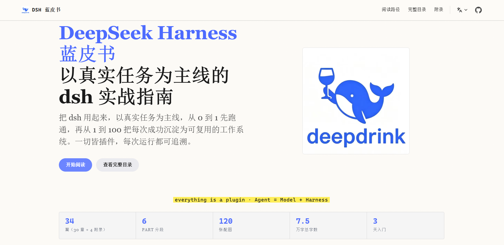

# DeepSeek Harness 蓝皮书

最近把折腾了一段时间的 DeepSeek Harness（简称 dsh）整理成了一份开源实战指南 —— **[DeepSeek Harness 蓝皮书](https://dsh.supermortal.top/)**（[GitHub 仓库](https://github.com/super-mortal/DeepSeekHarnessGuide)）。

## 这是什么

一份**以真实任务为主线**的 dsh 学习指南：从跑通第一个能验收的 Agent 开始，到搭出一套可复用的工作系统。它不是 API 文档的翻译，而是把"怎么用起来"这件事拆成了循序渐进的章节 —— 每一步的命令、截图、甚至报错，都是真实操作记录下来的，可以照着做复现。

视觉上做了一套 **E-INK 纸感 × DeepSeek 墨蓝** 主题：米白纸底、墨色文字、荧光黄标注，刻意把动效做到几乎为零，读起来更像一本纸书。支持中/英/日/韩/西/葡 **6 种语言**，内置了自研图片灯箱（点击放大、Ctrl+滚轮缩放、拖拽平移）。

## 讲些什么

全书按 PART 组织，从入门一路到生产环境：

- **PART 00-01 · 入门**：为什么是 Agent 的乐高时代；认识 dsh、安装、Web UI、headless 模式、模型配置与排错
- **PART 02-03 · 核心机制**：插件树、核心子系统与消息流、会话日志；工具与沙箱、MCP、子代理、Skill、调度、本地部署
- **PART 04 · 插件开发**：dsh 的精髓"一切皆插件" —— 从安装插件到编写插件再到发布插件，defineTool、Hooks、UI 一条龙
- **PART 05-06 · 实战与生产**：个人网站、PPT、视频三个实战场景；部署、安全、可观测性与上下文管理
- **附录**：术语表、命令速查、学习路径、面试题

每章遵循同一个模板：**本章目标 → 动手 → 分节实操 → 这一章你学到了什么**。实操章节还附赠"让 dsh 自己来：一句提示词"的玩法 —— 毕竟学 Agent 工具最好的方式，就是用 Agent 来干活。

## 写在最后

如果你也在用 dsh，或者对 Agent 工作流感兴趣，可以直接在仓库里按 PART 目录阅读。觉得有用的话，点个 Star 就是最大的鼓励 ⭐

- 在线阅读：**[dsh.supermortal.top](https://dsh.supermortal.top/)**
- 仓库地址：**[super-mortal/DeepSeekHarnessGuide](https://github.com/super-mortal/DeepSeekHarnessGuide)**
