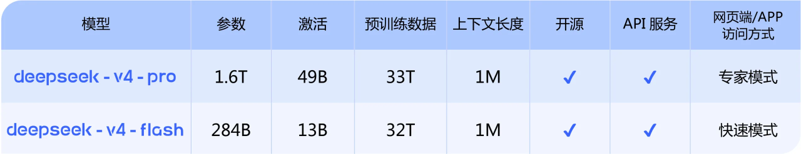
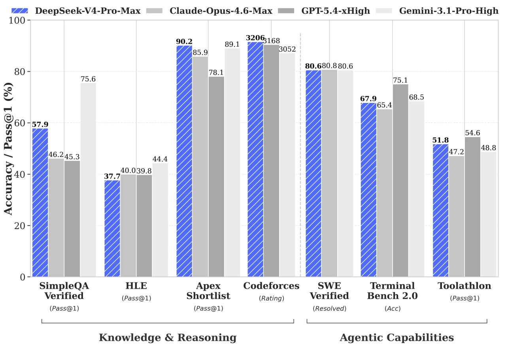
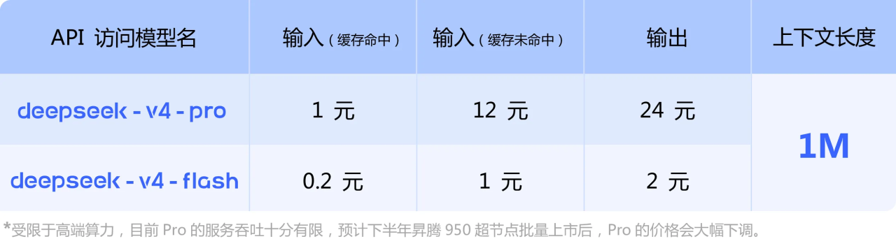

# DeepSeek-V4 终于发布!

> 前几天OpenAI发布的GPT-image-2，其生图能力真的刷新了我的认知，并且在昨天GPT-5.5也正式发布，同时，腾讯混元还发布了新的开源模型**腾讯混元 Hy3 preview** ，而在今天 DeepSeek 正式发布并且开源了 DeepSeek-V4，这也意味着**从今天开始，1M上下文是 DeepSeek 所有官方服务的标配** 身为湛江人，由衷为梁文锋与 DeepSeek 感到骄傲，特地写篇文章记录一下

## 一.DeepSeek-V4 是什么

DeepSeek\-V4是深度求索**（DeepSeek）**于2026年4月24日正式发布的新一代旗舰大模型，分为V4\-Pro与V4\-Flash两个版本，同步开源并开放API，支持本地部署、云端调用、IDE插件接入等多种方式

其核心定位的核心特点的：

- 纯国产算力训练，全栈适配华为昇腾生态
- 开源开放、可自由接入工具链，无平台绑定
- 百万token超长上下文，强推理、强代码生成能力
- 全平台开源：同步上线Hugging Face、魔搭社区，权重、代码、文档完全开放，开箱即用

## 二.版本对比

- DeepSeek-V4-Pro：对标顶级闭源模型，1.6T，49B激活，上下文长度1M；
- DeepSeek-V4-Flash：更小更快的经济版，284B，13B激活，上下文长度1M

> 官方原话是：**在Agent能力、世界知识和推理性能上均实现国内与开源领域的领先**

**并且**目前DeepSeek-V4已经成为公司内部员工使用的Agentic Coding模型，据评测反馈使用体验优于Sonnet 4.5，交付质量接近Opus 4.6非思考模式，但仍与Opus 4.6思考模型存在一定差距

> 官方很坦诚的直接说了 V4 跟Opus 4.6 的思考模式还有一定差距，但不急着否定，看看价格方面

DeepSeek V4 的 API 定价是输入 0.3美元，输出是 0.5美元每百万 token，缓存命中后输入甚至低到 0.03美元。而 GPT-5.5 是输入 5美元、输出 30美元。也就是说，GPT-5.5 的输出价格是 DeepSeek V4 的 60 倍！你用 GPT-5.5 花 60 块钱干的活儿，用 DeepSeek V4 只要 1 块钱。还是很让人兴奋的，并且 DeepSeek 还提到了，在下半年会大幅度降价

而且 DeepSeek V4 专门针对 Claude Code、OpenClaw、OpenCode 等主流 Agent 产品进行了适配和优化，AI 编程用户可以直接切换使用。

## 三.行业测评反馈

DeepSeek\-V4发布后，国内外AI领域专家、机构及技术博主纷纷开展测评，核心反馈如下，供参考

### 1.李沐

在MMLU（多任务语言理解）、GSM8K（数学推理）数据集上，V4\-Pro得分分别达88\.7分、92\.3分，超越Llama 3 70B、Qwen 2\.5 14B，接近GPT\-4o水平，中文推理、代码生成表现优于GPT\-5\.5。

### 2.梁文锋

V4全程采用国产算力训练，未依赖国外GPU，后续将重点优化多模态能力（图文、语音），对标GPT\-4o图片模型，同时降低部署门槛，普惠更多开发者。

### 3.Hugging Face官方团队

V4\-Pro综合性能超越Llama 3 70B，代码生成能力领先5\.2分，接近GPT\-5\.5水平；开源友好度高，支持一键调用，发布3天Hugging Face仓库下载量突破10万次

## 四.DeepSeek 近期融资动态

自 DeepSeek 成立以来，一直都是由母公司幻方量化孵化并持续“自我供血”，多次拒绝头部VC及科技巨头投资，保持财务独立，但在 2026年4月17日，其首次启动外部融资，核心信息如下

- 估值：超100亿美元，最近有**传闻**已上调至200亿美元

- 融资规模：计划募集不少于3亿美元（约20\.5亿元人民币）

DeepSeek 最圈粉的特质，从来不止是强悍的模型性能，更是**极致开放、中立独立、无绑定、普惠开发者**的姿态，而这次融资，可以给 DeepSeek 带来更强的算力储备、人才扩张、多模态研发投入，加速模型迭代与商业化落地，让国产顶尖大模型更快普及、降低调用成本，对于我们普通开发者和行业而言都是利好! 同时我也相信， DeepSeek 不会因为资本入局而丢掉原本的初心，我们不想看到一个纯粹靠技术出圈的国产黑马，最终被巨头生态裹挟、走向封闭、限制开源

## 五.相关链接

- [huggingface开源](https://huggingface.co/collections/deepseek-ai/deepseek-v4)
- [modelscope开源](https://modelscope.cn/collections/deepseek-ai/DeepSeek-V4)
- [DeepSeek-V4 技术报告](https://huggingface.co/deepseek-ai/DeepSeek-V4-Pro/blob/main/DeepSeek_V4.pdf)
- [个人观点，仅供参考](https://supermortal.cn)
