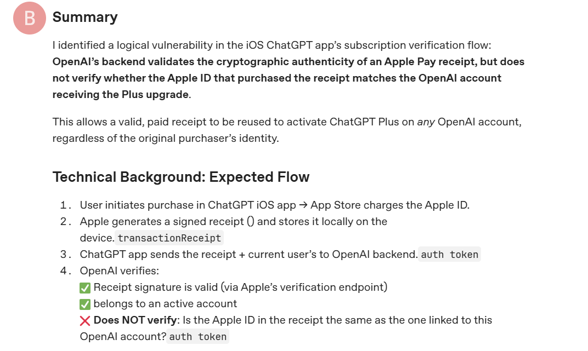

# GPT 充值漏洞解析

> 最近这段时间，网络上各种 GPT Plus 和 Pro 的代充层出不穷，并且只需要15-30块，可要知道官方充值 Plus 需要20刀，而 Pro 更是高达200刀，更离谱的是，部分不良商家 Plus 代充更是需要100-120块。多数人只看到低价优势，却不了解背后的核心原理：这类低价代充，本质是利用了 OpenAI iOS 内购的收据验证漏洞，本文仅从理论上进行实操讲解，仅作为技术学习参考，禁止商用牟利

## 一.正常官方订阅无漏洞流程

**以 iOS 内购为例：**

1. 你用自己的土区 Apple ID → 绑定土区信用卡 / 礼品卡
2. 在 ChatGPT App 点订阅 → Apple 扣款 → Apple 生成**加密收据（receipt\-data）**
3. App 把：**收据 + 你当前登录的 OpenAI Token** 发给 OpenAI 后端
4. OpenAI 验证：
   - 收据是 Apple 签名、真实有效 ✅
   - **收据所属 Apple ID = 当前账号的购买 Apple ID** ✅
5. 验证通过 → 给你账号开 Plus/Pro

关键点：**收据和 Apple ID、OpenAI 账号三者绑定，一收据只能用一次**

## 二\.核心漏洞简介

> 目前市面上所有所谓的 **“土耳其正规代充”** 本质都是利用了 OpenAI 对 iOS 内购收据的校验逻辑漏洞



1. 2026年4月17日，匿名开发者 **BugstoOai** 在 OpenAI 官方社区（ChatGPT Bugs 板块）发布了一篇安全报告，标题为《\[Security Report\] Apple Pay receipt validation does not bind to purchaser Apple ID》，这是该漏洞首次在公开渠道被披露，也是唯一 一次出现在 OpenAI 官方相关渠道的记录
2. 报告核心结论清晰明确：OpenAI 对 iOS 版 ChatGPT Plus 的订阅验证流程，仅验收获据（receipt\-data）的加密真实性（即是否有苹果官方签名），不验证购买该收据的 Apple ID，与接收 Plus 订阅的 OpenAI 账号是否存在绑定关系，这一逻辑缺陷直接导致 **“一张真实有效的收据，可无限次给任意 OpenAI 账号开通 Plus 订阅”**
3. 通俗易懂的来讲，**就好比你拿一张小票去兑换礼品，商家只要核验这张小票是真的，就把对应的礼品给你，紧接着你的七大姑八大姨都拿这张小票去兑换礼品，商家继续核验小票是真的就又把礼品给你，而不会去核验这张小票是否已经领取礼品了**
4. 总结下来就是 **OpenAI 只验收据真假，不验 “收据是谁买的、给谁用的”** 也就是：

- 只看：**收据有效 + Token 有效 = 直接开 Plus/Pro**
- 不看：**这张收据是不是你的 Apple ID 买的**
- 不看：**收据和 OpenAI 账号是否一一对应**

5. [漏洞原文地址](https://community.openai.com/t/security-report-apple-pay-receipt-validation-does-not-bind-to-purchaser-apple-id-potential-subscription-bypass/1379167?utm_source=chatgpt.com)

## 三\.完整流程

### 1\. 前置准备

- 环境：确保电脑已安装 Python（3\.7 及以上版本），打开终端/命令提示符，输入 `python -version` 验证是否安装成功

- 硬件：一台 iPhone/iPad（用于购买内购、抓包）和一台电脑（用于运行抓包工具）
- 软件：抓包工具二选一（Charles 简单易上手，适合新手；mitmproxy 适合开发者，跨平台）

- 安装命令：在终端输入 `pip install mitmproxy`，等待安装完成（Mac/Linux 可能需要用 `pip3` 替代 `pip`）
- 验证安装：输入 `mitmproxy`，若终端出现 mitmproxy 交互界面，即安装成功
- 其他：余额充足的土耳其区 Apple ID（用于购买 GPT Plus 内购）、已登录 OpenAI 账号的浏览器

### 2\.拦截并导出苹果内购收据

这一步是所有操作的基础，只要拿到有效的 **receipt\-data**，就可以实现无限复用，具体步骤如下：

1. 配置手机代理：电脑和手机连接同一个 WiFi，打开 Charles，查看电脑的局域网 IP；打开 iPhone，进入 WiFi 设置，点击已连接的 WiFi，选择“配置代理”，输入电脑 IP 和默认端口号
2. 安装信任证书：手机浏览器打开地址 chls\.pro/ssl，下载并安装 Charles 根证书；进入手机设置 → 通用 → 证书信任设置，完全信任该证书（目的是解密 HTTPS 流量，否则无法看到加密的收据数据）
3. 购买内购并抓包：手机登录土耳其区 App Store，打开官方 ChatGPT iOS 客户端，进入升级 Plus 页面，完成付款（土耳其区价格 499 里拉，约 85 元）；付款瞬间，在 Charles 中过滤域名 chatgpt.com，找到 POST 请求 /backend\-api/subscription/upgrade
4. 导出收据：点开该请求的 Request Body，会看到一段 JSON 数据，其中 \&\#34;receipt_data\&\#34; 对应的长串 base64 字符串，就是苹果内购收据，全选复制，保存到记事本即可——这条收据是 **加密二进制 + base64** 永久有效，可无限复用

补充：除了 Charles，也可以用 mitmproxy 抓包，操作逻辑一致：启动 mitmproxy 后，配置手机代理（IP 为电脑 IP，端口默认 8080），安装 mitmproxy 根证书，购买内购后，在 mitmproxy 终端找到对应请求，提取 **receipt\-data** 即可，抓包核心是“拦截 ChatGPT 向 OpenAI 提交收据的请求”，两种工具均可实现

### 3\. 获取 OpenAI 账号 session token

token 是账号的授权凭证，兑换 CDK 时必须提供，获取步骤非常简单：

**第一种**

1. 用浏览器打开 chatgpt.com，登录自己的 OpenAI 账号
2. 按 F12 打开开发者工具，切换到 Application 选项卡
3. 左侧找到 Cookies → 选中 chatgpt\.com，找到键为 \_\_Secure\-next\-auth\.session\-token 的值，复制完整字符串，就是该账号的 session token

**第二种**

1. 浏览器登录 ChatGPT，访问

```markdown
https://chatgpt.com/api/auth/session
```

2. 全选复制里面的 access oken（也叫会话 Token）

### 4\. CDK 与 token 的兑换流程

> CDK 本质是收据的“核销凭证”，经过**自定义加密/编码** 打包成了CDK，

- 将session token 和 CDK 一并提交
- 后端验证 CDK 并取出绑定的 **receipt\-data ** 组装 OpenAI 升级 API 请求，带上用户的 token 鉴权，提交给 OpenAI 后端
- OpenAI 校验收据和 token 有效后，给用户账号开通 Plus 订阅，返回开通成功提示

### 5\. 核心 API 原始请求

如果想直接测试收据和 token 的有效性，可以用 Postman 或 curl 调用 OpenAI 官方升级接口，具体请求如下：

```http
POST https://chatgpt.com/backend-api/subscription/upgrade
Header:
Authorization: Bearer 【用户的session-token】
Content-Type: application/json

Body:
{
  "receipt_data": 【你抓包保存的base64收据】
}
```

## 四.为什么是土耳其而非其他国家

1. **最根本的原因——价格全球最低，套利空间最大**

OpenAI 采用 “购买力平价（PPP）” 的本地化定价策略，会根据不同国家的经济水平、货币汇率，制定差异化的 ChatGPT Plus/Pro 订阅价格，而非全球统一定价。其中，土耳其区的定价是目前全球最低的，2026年 ChatGPT Plus 月费约为499土耳其里拉，折合人民币仅77\-85元，相比美区19\.99美元（约137元）、欧区22\.99欧元（约181元），价格直接减半，甚至比印度（1999卢比≈145元）、菲律宾（999比索≈113元）等其他低价地区还要低

2. 其次——漏洞适配性强，无额外风控阻碍

结合本次 OpenAI iOS 内购收据漏洞来看，土耳其区的收据适配性极强，没有额外的风控阻碍：

- 收据通用性高：土耳其区 iOS 内购生成的 **receipt\-data**，和其他地区的收据格式完全一致，均可直接调用 OpenAI 的升级接口，无需额外破解或适配，只要收据真实有效，就能无限复用。
- 前期风控宽松：在漏洞公开初期，OpenAI 对土耳其区的收据复用行为没有专门的风控拦截，同一张收据可批量给成千上万个账号开通；即便目前进入灰度封堵阶段，土耳其区收据的成功率依然高于其他低价地区，这也是代充不愿更换地区的原因之一

## 五.常见疑问

### 1.CDK 和 receipt\-data 是什么关系

receipt-data 是底层真实凭证，是苹果返回的真实内购收据（base64 长串），OpenAI 真正认的凭证，永久有效、可无限复用。而 CDK 是上层兑换码，是生成的随机兑换码（如 16 位字符串），是为了让 receipt-data 不直接售卖导致泄露，核心关系是商家卖 CDK 给你，你去商家提供的网站充值时，系统后端经过两层处理，第一验证 CDK 是否还是未使用的有效的，防止卖给你一个 CDK 你自己可以去充值无数个会员了。第二，如果是未使用的有效，就调出这个 CDK 对应的 **receipt\-data** 发送给 OpenAI 后端进行验证充值Plus/Pro

### 2.为什么一个 receipt\-data 可以有多个 CDK

原始苹果支付收据只有 1 份二进制原始数据，是固定不变的，不会自己变，商家把同一份原始收据 Base64 字符串做一层自定义 加密 / 编码 生成无数个随机字符串（CDK），然后回到第一个疑问，你去用这个 CDK 充值的时候，验证有效之后才会调出 receipt\-data 发生给 OpenAI 后端进行校验充值
