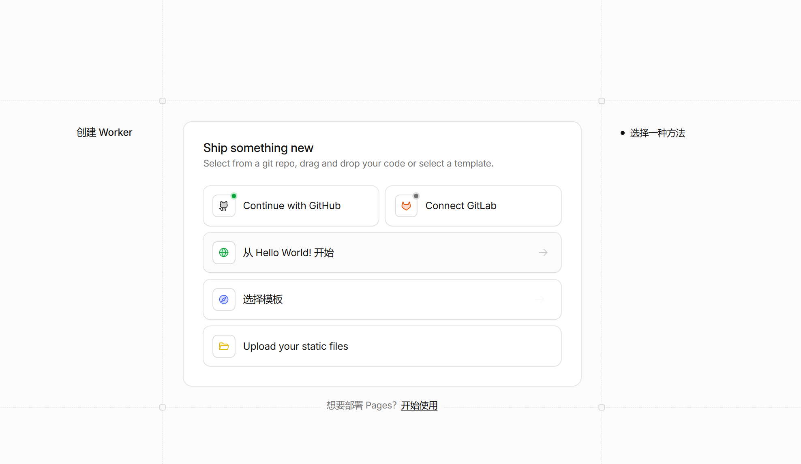
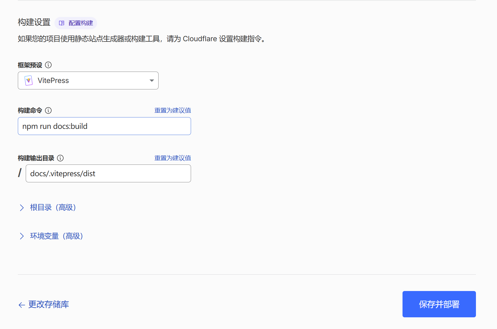

# 使用Cloudflare Pages 部署 VitePress 站点

> 前一阵子用AI写的小说现在已经托管到了 Cloudflare Pages 上，部署过程中遇到了一点小问题，网络上很多教程都是旧版所以特地写了一个文章来总结一下

## 一.前置条件

1. 本地 VitePress 项目可正常打包，执行 `npm run docs:build` 不报错；
2. 项目已上传至 GitHub 仓库（非必须但极推荐）
3. 拥有 [GitHub](https://github.com) 和 [Cloudflare](https://cloudflare.com) 账号，可以直接使用 GitHub 账号授权注册 Cloudflare 账号

## 二.开始部署

1. 进入 Cloudflare Pages 控制台的主页面，点击左侧的 workers-and-pages 选项
2. 点击右上角创建应用程序
3. 进入下图选项，点击下方小字，开始使用

4. 选择导入现有 Git 仓库，然后选择你要部署的那个项目所在仓库
5. 然后项目名称可以填一个你想要的就行也可以直接默认
6. 构建设置的话按照下图的展示进行填写即可完成后点保存并部署，等待几分钟即可部署完成

