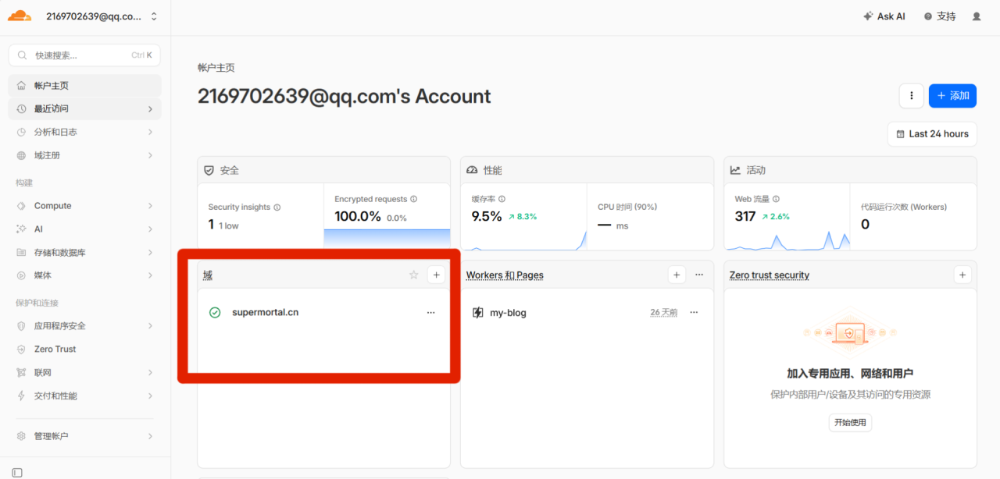
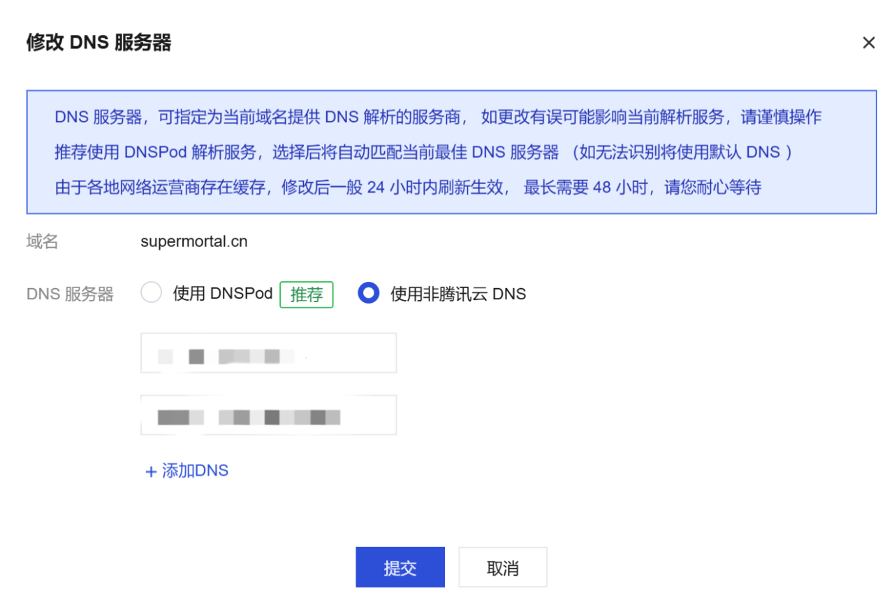

# 通过Cloudflare加速个人网站

> 我的博客搭建完成后，发现加载速度很慢，于是在网上搜索了一下教程，看到几乎都是用Cloudflare来进行免费加速，但有个问题，教程大多数为2024年的，没有新教程了，Cloudflare页面以及功能发生了很大的变化，不过好在琢磨了一下之后，也是成功使用Cloudflare提供的免费CDN来加速我的个人博客了

## 一.基础知识

### 1.什么是 Cloudflare？

Cloudflare 是一家提供内容分发网络（CDN）、DDoS 防护、SSL/TLS 加密等服务的公司。它通过全球分布的服务器网络，将你的网站内容缓存到离用户更近的位置，从而加速访问。

**Cloudflare 的主要优势：**

- **🚀 全球加速**：通过 200+ 个数据中心加速网站访问
- **🛡️ 安全防护**：DDoS 攻击防护、Web 应用防火墙
- **🔒 SSL/TLS 加密**：免费 SSL 证书，自动 HTTPS
- **📊 分析统计**：详细的流量分析和安全报告
- **💰 免费计划**：个人网站完全够用
- **🌐 中文界面**：支持中文控制面板

### 2.什么是 CDN？

CDN（Content Delivery Network，内容分发网络）是一个由多个服务器组成的网络，这些服务器分布在全球各地。当用户访问你的网站时，CDN 会自动选择离用户最近的服务器来提供内容，从而：

1. **减少延迟**：缩短数据传输距离
2. **提高速度**：更快加载网页内容
3. **降低负载**：减轻源服务器压力
4. **增强可用性**：即使某个服务器宕机，其他服务器仍可提供服务

## 二.详细配置步骤

1. 访问 [Cloudflare 官网](https://dash.cloudflare.com/sign-up)，注册 Cloudflare 账号
2. 注册完成后登录进入首页，在下方域中点击添加，输入你的域名点击下一步，选择Free计划之后确定

3. 然后划到最底部，查看Cloudflare分配的DNS服务器信息，通常类似：`lily.ns.cloudflare.com` 和 `moe.ns.cloudflare.com`，然后到域名服务商的控制台更改DNS服务器信息
4. 以腾讯云为例，进入域名管理页面后，点击需要加速的域名右侧的更多点击修改DNS服务器

5. 弹出的页面选择“使用非腾讯云 DNS”，将第3步中获取到的信息填写在下面两个框框中然后点击提交即可，等待一会会就可以生效
6. 最后回到cloudflare中你的这个域名，进入DNS解析，然后按照vercel中提供的信息进行解析即可，最后记得开启代理（代理状态栏下显示橙色云朵已代理）

## 三.优化配置建议

### 1.SSL/TLS 设置

- 进入 "SSL/TLS" → "概述"
- 将加密模式设置为 **完全（严格）**
- 这样 Cloudflare 和你的服务器之间也会加密，提高安全性

### 2. 缓存配置

- 进入 "缓存" → "配置"
- **Always Online**：启用（即使源服务器宕机，访问者也可以看到临时错误提示页面）

## 四.效果对比

### 加速前：

- 全球访问速度不一致
- 国内用户访问慢
- 服务器直接暴露
- 无 DDoS 防护

### 加速后：

- ✅ 全球访问速度提升 30-50%
- ✅ 国内用户访问显著改善
- ✅ 服务器 IP 隐藏，增强安全
- ✅ 免费 DDoS 防护
- ✅ 自动 HTTPS
