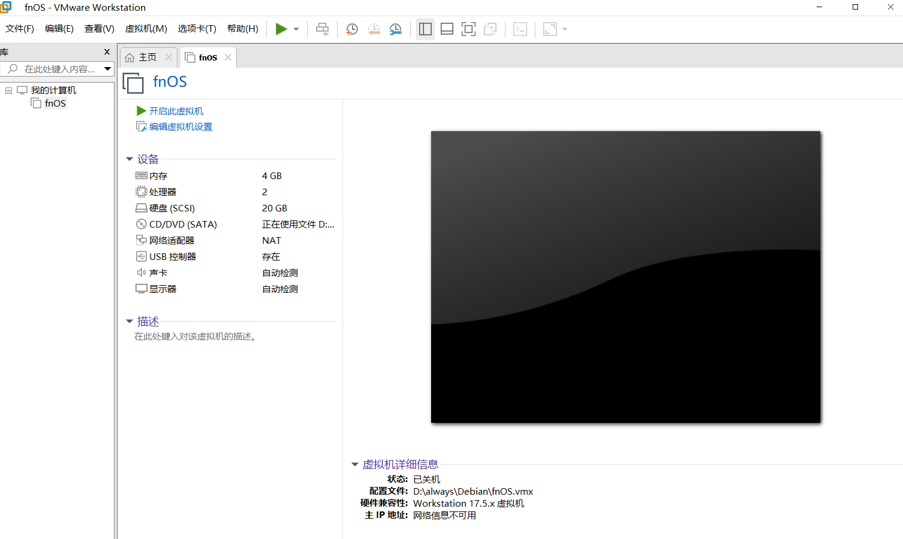
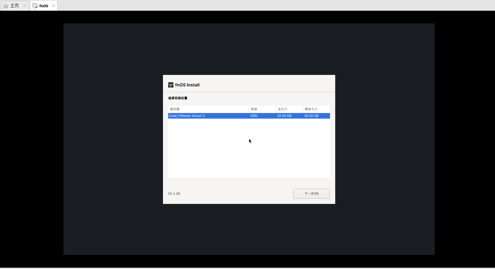
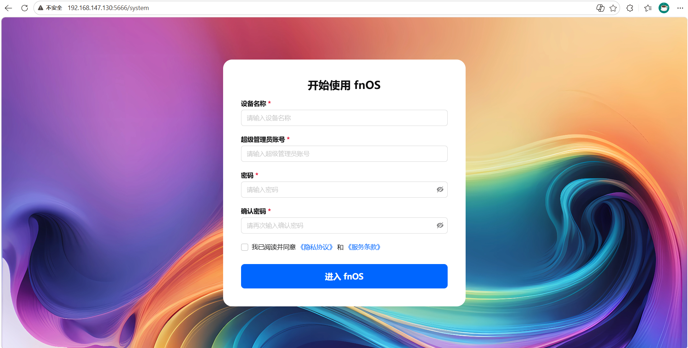
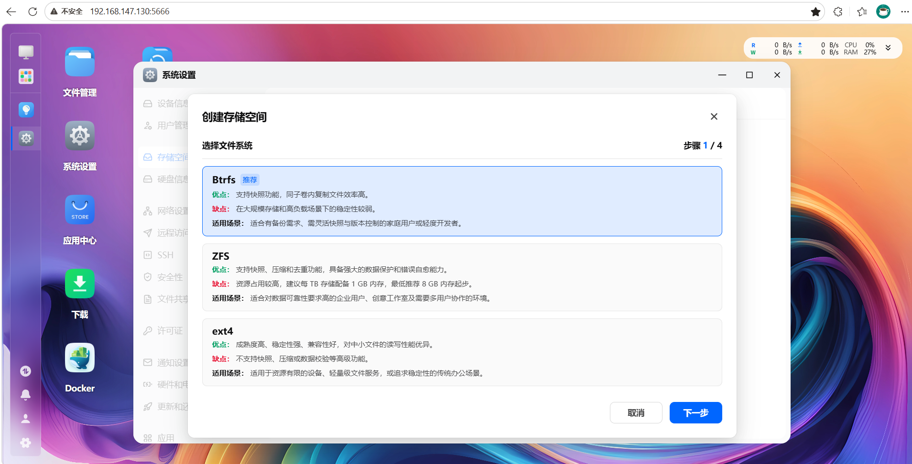
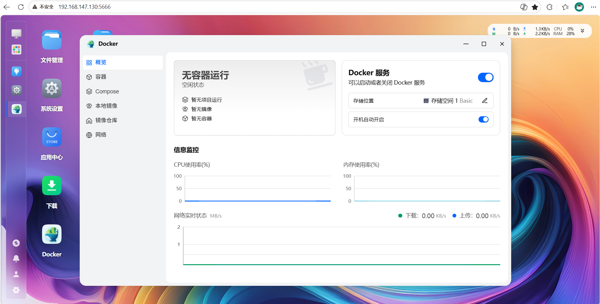

# VMware 虚拟机部署 fnOS 飞牛私有云

## 一.下载所需文件

### 1. VMware Workstation Pro 下载

- **官方下载地址**：[VMware 官网产品页](https://www.vmware.com/products/workstation-pro.html)

### 2. fnOS 飞牛私有云镜像下载

- **官网下载**：[https://www.fnnas.com](https://www.fnnas.com)

进官网找到最新版的 fnOS ISO 镜像下载。x86 设备选标准版就行，ARM 设备可以留意官网的 ARM 公测版

## 二.检查并开启 CPU 硬件虚拟化

### 1 Windows 系统内查看虚拟化是否启用

1. 右键底部任务栏 → 打开**任务管理器**
2. 顶部切换到【性能】→ 点击左侧【CPU】
3. 右侧下拉找到**虚拟化**选项

- 显示【已启用】→ 系统层面没问题，跳过这步
- 显示【已禁用】→ 需要进 BIOS 开启，往下看

### 2 进 BIOS 开启 VT-x（虚拟化技术）

虚拟化如果显示禁用，需要进电脑的 BIOS 把 VT-x 打开。不同品牌进 BIOS 的方式略有不同，这里整理了一下常见的按键

| 电脑品牌 / 主板类型   | 开机时按键             |
| --------------------- | ---------------------- |
| 华硕 ASUS             | F2（或 Del）           |
| 技嘉 GIGABYTE         | Del                    |
| 微星 MSI              | Del                    |
| 华擎 ASRock           | F2（或 Del）           |
| 联想 Lenovo（笔记本） | F2（或 Fn+F2）         |
| 联想 ThinkPad         | F1（或 Enter 再按 F1） |
| 戴尔 Dell             | F2                     |
| 惠普 HP               | F10                    |
| 宏碁 Acer             | F2                     |
| 小米 / Redmi 笔记本   | F2                     |
| 华为 MateBook         | F2（或 Fn+F2）         |

**操作步骤：**

1. **重启电脑**，在开机画面（品牌 Logo 出现时）连续按上面对应的按键
2. 进入 BIOS 界面后，找到 **Advanced** 或 **Configuration** 菜单（中文界面叫"高级"或"配置"）
3. 寻找以下选项之一（不同主板命名略有差异）：
   - **Intel Virtualization Technology**（Intel VT-x）
   - **SVM Mode**（AMD 平台的叫法）
   - **Virtualization Technology**
   - **VT-x**
4. 把它设为 **Enabled**（启用）
5. 按 **F10** 保存并退出，选择 Yes 重启

> **小提示**：如果进 BIOS 后发现找不到这些选项，可能是 BIOS 被锁定了高级菜单。华硕等品牌需要在 BIOS 中按 F7 进入 Advanced Mode 才能看到完整选项。

### 3 关闭 Windows 自带 Hyper-V

这一步很容易忽略。Windows 自带的虚拟机服务和 VMware 冲突，哪怕 BIOS 开了虚拟化，Hyper-V 不关的话依然会报错、网络不通、后台打不开。

1. 打开控制面板 → 程序 → 启用或关闭 Windows 功能
2. 下拉列表，把以下三项**全部取消勾选**：
   - Hyper-V（全部子目录一起取消）
   - 虚拟机平台
   - Windows 沙箱/盒
3. 点击确定，根据提示**重启电脑**生效

**核心总结**：虚拟化一共两层开关——BIOS 底层 + Windows 系统层。两层全部打开，VMware 才能正常运行，缺一不可

## 三.安装飞牛和创建储存空间

### 1.安装飞牛

1. 打开 VMware → 创建新的虚拟机 →选典型 (推荐) → 下一步
2. 选择安装程序光盘镜像文件 (ISO) → 选择刚下的 fnos ISO → 下一步
3. 客户机操作系统选 Linux → 版本选 Debian 12.x 64 位 → 下一步

4. 给虚拟机取个名字，我的是 fnOS；位置：选一个非 C 盘、空间大的目录 → 下一步
5. 最大磁盘大小：15-20G，这里直接选择15-20G就够了，用作安装系统的镜像，后续再扩展磁盘做硬盘储存
6. 点自定义硬件（最关键的一步）在弹出的窗口里，改这 4 项

- 内存：改成 4096 MB（4GB），有 8G 内存就给 8192
- 处理器：2 核 或更多，勾选「虚拟化 Intel VT-x/EPT」
- 新CD/DVD(IDE)：确认是你那个 fnOS ISO，勾选启动时连接
- 网络适配器：选 NAT 模式（最简单，能上网）

7. 都弄好之后 → 点 关闭 → 再点完成，就可以看见回到了主页面

8. 然后选中fnOS（自己填写的名字），点击开启此虚拟机

9. 虚拟机开启后会看到如上页面，直接点击下一步，再点击下一步，然后会弹出一个关于格式化硬盘的说明直接点击确定即可，这里说的操作只针对 VMware 生成的虚拟磁盘文件，跟本机硬盘完全隔离，数据百分百安全，无需担心
10. 启动完成后自动进网络设置，默认 DHCP（自动获取 IP 的意思）不需要修改 ，**然后记录下面显示的 IP 地址**即可→ 保存
11. 等一会之后，浏览器打开第10步中记录的 IP 就能进入 fnOS 的 Web 后台初始化界面了

12. 然后自己设置一个名称，账号以及密码就可以进去了，到了这里还需要给他扩展磁盘做存储用的磁盘

### 2. 扩展磁盘空间

1. 关机这个虚拟机，再设置的地方找到硬盘选项，点击扩展硬盘，选择要扩展的大小，根据喜好即可
2. 然后重新启动虚拟机，输入之前记录的 IP 进入飞牛的web页面，点击系统设置，点击储存空间管理，创建储存空间

3. 选择系统推荐的然后点击下一步，然后选择刚刚扩展的那个硬盘，然后储存模型选择 Basic 和 Linear 都可以，然后一直下一步最后输入管理员密码进行插件即可
4. 完成之后点击 Docker 进行首次启动，选择docker的数据目录就行了，就可以看见docker服务弄好了

## 四.开启 FN-Connect 远程访问

> FN-Connect 是飞牛自研内网穿透服务，无需公网IP，凭FN ID加密远程访问NAS，开启之后就可以在任何设备上直接访问你这个电脑的虚拟机上安装的飞牛了，需要有飞牛账号，前往[飞牛官网](https://www.fnnas.com) 进行免费注册就行了

1. 在飞牛的 web 后台，点击系统设置，然后选择远程访问，点击开启 FN-Connect ，在弹出的登录框中直接登录的飞牛账号就行了，然后设置自己名字，这个名字是唯一的，如果其他用户有了会让你重新设置，好了之后，剩下的会全自动完成，最后就可以获得一个格式为 **https://fnos.net/你设置的名字**的远程访问地址了

## 五.常见问题

**Q1：虚拟机硬盘格式化，会不会清空我电脑本地的资料？**

A：绝对不会。所有操作只针对 VMware 生成的虚拟磁盘文件，跟本机硬盘完全隔离，数据百分百安全。

**Q2：开机一直提示移除安装镜像，必须移除吗？**

A：不一定，虚拟硬盘已经装好系统了，光驱挂着的 ISO 不影响启动和使用。关机之后再去删除就行
