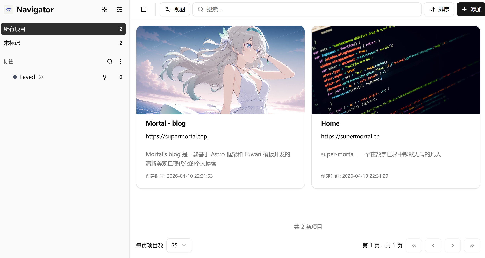

# Link-Navigator使用说明

## 一.项目定位

Link-Navigator 是一个自托管书签管理系统，用于保存、分类、搜索和整理网页链接。

核心特点：

- 数据自托管（SQLite 本地存储）
- 支持标签分类与嵌套标签
- 支持导入浏览器/Pocket/Raindrop 书签
- 支持书签封面图（可手填、自动抓取、随机图）



## 二.快速部署

1. 一键部署命令

```bash
git clone https://github.com/super-mortal/Links-Navigator.git
cd Links-Navigator
docker compose up -d --build
```

2. 部署完成后访问：

- HTTP：`http://你的服务器IP:4124`
- HTTPS：`https://你的服务器IP:4125`

## 三.首次初始化说明

首次进入系统时，会进入初始化流程：

1. 创建数据库
2. 创建登录账户
3. 可选设置集成/导入

## 四.日常使用逻辑

### 1.添加书签

进入首页后，点击右上角“添加”。

建议填写字段：

- 网址（必填）
- 标题
- 描述
- 图片网址（可选）
- 备注（可选）
- 标签（强烈建议）

辅助功能：

- 网址输入后可点抓取按钮，自动获取标题/描述/图片
- 图片区域右侧有“随机”选项，勾选后保存时自动调用随机图片 API

保存后，书签会出现在列表中

### 2.编辑书签

在书签条目右侧操作菜单中可进行：

- 编辑
- 刷新元数据
- 删除

编辑页可修改标题、描述、图片、标签和备注

### 3.书签分类

本项目以“标签”作为分类核心。

- 一个书签可以打多个标签
- 标签支持父子层级（嵌套）
- 左侧栏可按标签筛选

### 4.批量操作

在列表中勾选多个书签后，可进行：

- 批量打标签
- 批量删除
- 批量刷新元数据

### 5.导入已有书签

在设置 -> 导入页面可导入：

- 浏览器导出的 HTML 书签
- Raindrop.io 导出的数据
- Pocket 导出的ZIP

### 6.数据存储与备份

数据库类型：SQLite

容器内数据库路径：

- `/var/www/html/storage/link_navigator.db`

宿主机默认永久存储路径（Docker Volume）：

- `/var/lib/docker/volumes/link-navigator_link-navigator-storage/_data/link_navigator.db`

建议定期备份该 `.db` 文件与 `img` 目录。

## 五.更新部署

进入项目目录后执行：

```bash
git pull
docker compose up -d --build
```

说明：

- 代码会更新并重新构建镜像
- 数据卷不删除，历史数据会保留

## 六.发展规划

**按先后顺序排序**

1. 新增所有书签导出功能
2. 新增便签板块

## 七.常见问题

### 1.为什么看不到“安装应用”图标？

常见原因：

- 使用了 IP + HTTP（非 HTTPS）
- 浏览器不支持或未触发安装条件
- 页面停留时间与交互未满足条件

简化结论：

- `localhost` 场景下 HTTP 通常可安装
- `IP:端口` 场景一般需要 HTTPS 才会显示安装入口

### 2.为什么重建容器后数据还在？

因为使用了 Docker Volume 持久化，重建容器不会清空数据

## 八.致谢🙏

\- 原开源项目：[denho/faved](https://github.com/denho/faved)

\- 为本项目提供免费图片接口：[LoliAPI](https://loliapi.com)

\- 为本项目提供部署托管支持：[狐蒂云](https://www.szhdy.com/aff/EKJAJGGB)
