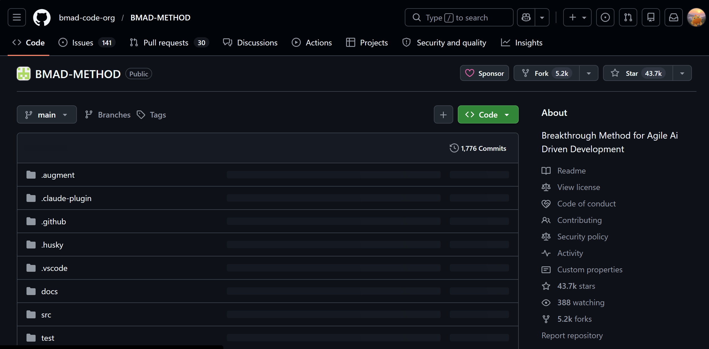
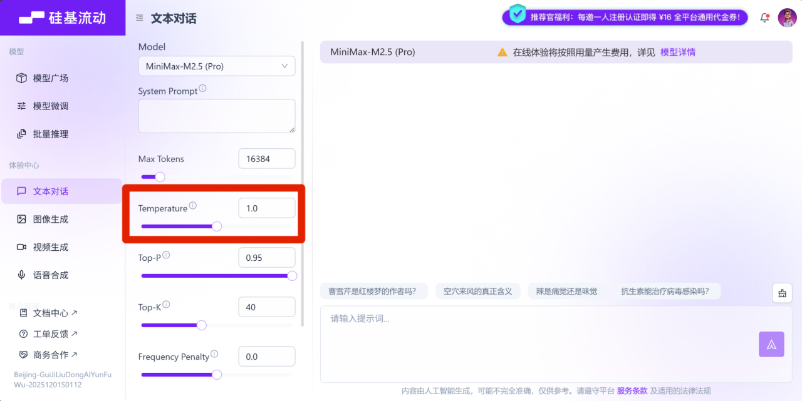

# 一文搞懂 AI 编程的核心术语

> 以前我对AI的认知很简单，以为不过是像豆包那样聊天问答、查资料的工具。直到今年一月偶然接触到Kiro、Cursor这类**AI IDE**，才真正见识到AI的强大。在AI编程的实战中，我不仅学到了大量知识，也熟悉了许多核心技术术语，于是想写篇文章好好总结一番


## AI 基础概念

### 人工智能（AI）

1. 人工智能（Artificial Intelligence）是让计算机模拟人类智能的技术。简单来说，就是让机器能像人一样思考、学习和解决问题。
2. 在 Vibe Coding 中，AI 就是你的编程助手。你只管告诉它要做什么，它就会嘎嘎帮你做方案、写代码、修 Bug，就像你有一个 24 小时在线的程序员朋友，随时可以帮你干活。

### 大语言模型（LLM）

1. 大语言模型（Large Language Model）是一种能够理解和生成人类语言的 AI 系统，ChatGPT、Claude、Gemini、DeepSeek 都是大语言模型。
2. 为什么叫 “大” 模型呢？因为这些模型的**参数量**非常庞大，动则几十亿甚至上万亿个参数，参数越多，模型通常越聪明，但也越消耗计算资源。
3. 你可以把大语言模型理解成一个读过海量书籍和代码的超级学霸，它见过无数的编程案例，所以能帮你写代码、解释代码、修复 Bug。
4. 除了文本大语言模型之外，AI 领域还有专门处理图片的视觉模型（比如 Stable Diffusion），处理语音的音频模型（比如 Whisper）、以及能同时处理文字、图片、音频的多模态模型（如Gemini），在 AI 编程时，我们主要和文本大语言模型打交道。

### Token

1. **Token**是 AI 模型处理文本的基本单位，现在中文名官方叫**词元**
2. Token 是必须掌握的核心概念，因为 AI 服务通常按照 Token 收费，你输入的文字和 AI 输出的文字都会消耗 Token，Token 用得越多，花的钱就越多。
3. 在英文中，一个 Token 大约是**一个单词或单词的一部分**，在中文中，一个汉字通常是 1 ~ 2 个 Token
4. 目前很多 AI 编程工具（比如 Cursor、Claude Code）都自带了 Token 消耗量的实时统计和展示，方便随时掌握用量和成本。

### 输入 Token 和输出 Token

1. AI 服务在计费时，一般会分别计算输入和输出的 Token。

- 输入 Token：你发给 AI 的内容，比如提示词、代码、文件等
- 输出 Token：AI 返回给你的内容，比如回答、生成的代码、工具调用指令等

2. 一般来说，输出 Token 比输入 Token 更贵，以 Claude Sonnet 4为例，输入价格是 3 美元/百万 Token，输出价格是 15 美元/百万 Token，贵了 5 倍。这是因为生成内容比理解内容更消耗算力
3. 最简单的一个省 Token 小技巧是：**用心编写简洁清晰的提示词**，让 AI 一次就能理解你的需求，减少反复对话

### 模型参数

1. 参数是模型在**训练过程**中学到的 “知识点”，用数字的形式存储在模型中。
2. 举个好理解的例子，模型在训练时读到了大量 “天空是蓝色的” 这类内容，它就会在参数中记住 “天空” 和 “蓝色” 之间的关联关系。参数越多，模型能记住的知识和关联就越丰富。
3. 参数量直接影响模型的能力和使用成本。参数越多，模型越聪明，但运行时消耗的算力（GPU 计算资源）也越多，所以价格也越贵。
4. 目前主流大模型中，明确公开参数量的有：

- DeepSeek-V3：6710 亿参数（采用 MoE 混合专家架构，实际激活 370 亿）
- Qwen3-235B：2350 亿参数（通义千问系列，激活 220 亿）
- Llama 4 Scout：1090 亿参数（Meta 开源模型，激活 170 亿）

> 值得一提的是，即使是同一系列的大模型，厂商也会提供不同参数量的版本供你选择

### 模型训练和推理

1. **训练**（Training）是让 AI 模型从大量数据中学习知识的过程。这个过程需要海量的计算资源和时间，一般由 AI 公司完成。绝大多数情况下，你不需要自己训练模型，直接用训练好的成品就行。
2. **推理**（Inference）是模型训练完成、具备了知识之后，用学到的知识来回答问题、生成内容的过程。我们日常使用 AI 工具，比如和 ChatGPT 对话、让 Cursor 写代码，本质上都是 AI 模型在进行推理

> 打个比方，训练就像学生上学读书，推理就像学生参加考试答题。

### 模型微调（Fine-tuning）

1. 微调是在已有模型的基础上，用特定领域的数据继续训练，让模型在某个领域表现更好。
2. 比如，你可以用大量的医学资料微调一个模型，让它成为医学专家。或者用你公司的代码库微调，让它更了解你的项目风格。
3. 对于普通用户来说，微调成本较高，一般不需要自己做，直接使用现成的模型就够了。不过，很多大模型应用开发平台（比如阿里云百炼、火山引擎等）都提供了模型微调的能力，降低了微调的门槛。

### 上下文窗口

1. 上下文窗口（Context Window）是指 AI 模型一次能 “记住” 的最大内容量，用 Token 来衡量。
2. 不同模型的上下文窗口大小不同：

- GPT-4o：128K Token（约 10 万中文字）
- Claude Opus 4.6：标准 200K Token，支持扩展到 1M Token（约 75 万中文字）
- Gemini 3.1 Pro：1M Token（约 75 万中文字），且支持同时处理文字、图片、音频、视频

3. 上下文窗口越大，AI 能处理的代码量就越多，能记住的对话历史就越长。如果你的项目代码很多，或者你不确定 AI 能否在一次对话中完成任务，选择上下文窗口大的模型会更合适。

> 但要注意，上下文窗口越大，每次请求消耗的 Token 也越多，成本也会更高。比如在 Cursor 中使用 Claude Sonnet 模型时，单次请求超过 20 万 Token，输入价格就会翻倍。

### API访问核心配置

**使用 AI 编程工具对接大模型时，需配置三个基础参数完成接口访问：**

1. **Base URL**：大模型 API 的基础请求地址，决定了工具向哪个服务器发起请求

- 官方默认 Base URL：如 GPT 为 `https://api.openai.com/v1`、DeepSeek 为 `https://api.deepseek.com/v1`；
- 自定义场景：私有部署模型、第三方代理、本地模型服务均需修改 Base URL 适配

2. **API Key**：接口访问的身份凭证，由大模型厂商生成。

- 获取方式：在对应厂商的开发者平台/控制台创建应用后生成；
- 成本关联：API Key 绑定计费账户，接口调用产生的 Token 消耗会自动计费；
- 安全建议：使用环境变量或工具内置密钥管理，切勿明文写在代码或提示词中。

3. **Model ID（模型ID）**：指定要调用的具体大模型版本

- 作用：明确告诉服务器使用哪一款模型（不同参数、不同能力）；
- 示例：`qwen3-14b-instruct`、`gpt-4o-mini`、`deepseek-chat`；

> 三者关系：Base URL 决定“连到哪”，API Key 决定“你是谁”，Model ID 决定“用什么模型”

## 提示词相关

### 提示词（Prompt）

1. 提示词是你给 AI 的指令或问题。在 AI 编程中，提示词就是你用自然语言描述的需求。
2. 提示词的质量直接决定了 AI 输出的质量。一个好的提示词应该：

- 具体明确
- 包含必要的背景信息
- 说明期望的输出格式

> 比如，“做一个网站” 是一个模糊的提示词，而 “用 React 做一个记账网站，包含添加支出、查看列表、统计总额三个功能，界面用蓝色调” 就是一个更好的提示词

3. 在 AI 对话中，消息一般分为 3 种角色：

- 系统提示词（System）：设置 AI 的角色和行为规则，对用户不可见
- 用户提示词（User）：你发送给 AI 的消息
- 助手提示词（Assistant）：AI 回复给你的消息

解这 3 种角色有助于你更好地使用 AI。比如很多 AI 编程工具允许你设置系统提示词来定义 AI 的行为规则，而你在对话框中发送的内容就是用户提示词。

### 系统提示词

1. **系统提示词**（System Prompt）是在对话开始前给 AI 设置的指令，用来定义 AI 的角色、行为和限制。

> 比如，你可以设置系统提示词：“你是一位资深的 Java 后端开发专家，请用简洁清晰的代码风格回答问题。”

2. 系统提示词在整个对话过程中都会生效，是定制 AI 行为的重要方式。

### 提示词工程

1. 提示词工程（Prompt Engineering）是设计和优化提示词的技术，目的是让 AI 更好地理解你的意图，生成更符合预期的结果。
2. 这是 Vibe Coding 的核心技能之一。好的提示词工程师能用更少的对话轮次、更低的 Token 成本，让 AI 生成更高质量的代码。

### 零样本提示（Zero-shot）

1. 零样本提示是指在给 AI 下达任务时，不提供任何示例，直接描述你的需求让 AI 去完成。

> 如：“请把这段英文翻译成中文。”

2. AI 会根据自己的训练知识来完成任务,对于简单任务，零样本提示一般就够用了，不需要提供额外的示例内容，还能节约一些 Token 成本。

### 少样本提示（Few-shot）

1. 少样本提示是指在给 AI 下达任务时，额外提供几个输入输出的示例，让 AI 通过这些示例学习你想要的格式或风格，从而更准确地完成任务。

比如：

```markdown
请按以下格式翻译：
英文：Hello → 中文：你好
英文：Thank you → 中文：谢谢
英文：Good morning → 中文：
```

2. 通过提供示例，AI 能更准确地理解你的需求，输出更一致的结果。

### 思维链提示（Chain-of-Thought）

1. 思维链提示（Chain-of-Thought，简称 CoT）是一种引导 AI 展示推理过程、一步一步思考问题的提示技术，而不是让 AI 直接给出答案。这对于复杂的推理任务特别有效，比如多步骤的数学计算、代码逻辑分析、系统架构设计等。
2. 触发思维链提示的方法很简单。很多推理模型（比如 DeepSeek-R1）和 AI 编程工具天然内置了思维链能力，会自动展示推理过程。你也可以在提示词中手动加上 “请一步一步思考”，AI 就会展示它的推理过程，一般能得到更准确的答案。
3. 在 AI 编程中，涉及复杂业务逻辑、多模块交互、或者需要权衡多种技术方案的项目，特别适合利用推理模型和思维链提示能力，让 AI 想清楚再动手。

### Markdown 语言

1. **Markdown** 是一种轻量级的文本标记语言，用简单的符号来表示格式。比如用 `#` 表示标题，用 `**文字**` 表示加粗，用 `-` 表示列表。
2. 在 AI 编程中，Markdown 非常重要，因为：

- AI 生成的回答大多数都是 Markdown 格式
- 项目文档（如 README）采用 Markdown 编写
- 定义 AI 智能体的规则文件也是 Markdown 格式
- 包括我现在写的文章也是用Markdown 来写

**学会 Markdown** 能让你更好地跟 AI 交流，也能写出更规范的项目文档。更重要的是，结构化的内容（标题层级、列表、代码块等）有助于 AI 更准确地理解你的意图，同时也能培养你自己的结构化思维能力，这对写好提示词非常有帮助，更多markdown语法查看我的往期文章[Markdown基础语法](https://supermortal.cn/blog/markdown-ji-chu-yu-fa)和[Markdown进阶语法](https://supermortal.cn/blog/markdown-jin-jie-yu-fa)

## AI 编程模式

### Vibe Coding 氛围感编程

1. Vibe Coding 是由计算机科学家 Andrej Karpathy 在 2025 年 2 月提出的概念。它描述了一种全新的编程方式：通过自然语言和 AI 对话，让 AI 帮你写代码，你只需要描述需求、测试结果、指导方向。
2. 你不需要精通编程语法，只需要能清楚表达你的想法，AI 负责把你的想法变成可运行的代码。
3. 所以说，Vibe Coding 的重点不是写代码，而是明确需求并清晰表达。你描述得越清楚，AI 给你的结果就越靠谱。

> 这就像点外卖一样，你告诉外卖平台你想吃什么，餐厅帮你做好送到手上。你不需要会做饭，但要知道自己想吃什么。

### Agentic Engineering 智能体工程

1. Agentic Engineering（智能体工程）是 2026 年 2 月由 Andrej Karpathy（也就是提出 Vibe Coding 的那位大佬）提出的新概念，可以理解为 Vibe Coding 的规范版。
2. Vibe Coding 就是跟着感觉写代码：你给 AI 一句话，AI 吐出代码，能跑就行，跑不了就把报错粘回去让 AI 再改。做个小工具贼拉快，但项目一大就容易翻车。
3. 而 Agentic Engineering 的思路是：你先想清楚要干嘛、写好方案、拆好任务，再把活交给 AI 去执行，它干完了你还得验收，质量不行再打回去重做。

> 打个比方，Vibe Coding 的时候你是个 DJ，放什么歌全凭感觉；Agentic Engineering 里你是包工头，流程、质量、验收都得你说了算。**一个跟着感觉走，一个按流程来。**

4. 当然，不是说 Vibe Coding 已经过时了。Vibe Coding 负责让你看到可能性，Agentic Engineering 负责把可能性变成真正能用的东西。二者适用于不同的场景，做小工具时可以用 Vibe Coding，做企业级项目就需要 Agentic Engineering 的思维。

### Agentic Coding 智能体编程

1. Agentic Coding 智能体编程是指让 AI 像一个自主的 “智能体”（Agent）一样工作，能够自己规划任务、执行操作、验证结果，而不只是被动地回答问题。
2. 它和前面提到的 Agentic Engineering 的区别在于，Agentic Coding 强调的是 AI 的自主执行能力（AI 能干什么），而 Agentic Engineering 强调的是人对 AI 的管理方法论（人该怎么管）。
3. 如今，几乎所有主流 AI 编程工具都提供了智能体编程的能力。比如在 Cursor 的 Agent 模式中，AI 可以：

- 自动读取和分析多个文件
- 规划实现方案
- 执行代码修改
- 运行测试验证
- 自动修复问题

> 这比传统的问答式 AI 更强大，因为它能自主完成复杂的多步骤任务。可以说，AI 不再只是辅助编程的配角，而是正在成为项目开发的核心驱动力。

### 多智能体协作

1. 多智能体协作（Multi-Agent）是指多个 AI 智能体分工合作，共同完成复杂任务。
2. 比如，一个智能体负责设计架构，一个负责写前端代码，一个负责写后端代码，一个负责代码审查。它们像一个软件开发团队一样协作。
3. 这两年，多智能体系统正在成为 AI 编程的重要趋势。它的优势不仅仅是能处理更复杂的项目，还能通过并行工作大幅提升效率，让原本需要几小时的任务在几分钟内完成。

### 智能体编排

1. 编排（Orchestration）是指协调和管理多个 AI 智能体或 AI 任务的过程，确保它们按正确的顺序和方式工作。
2. 如果说多智能体协作关注的是 “有哪些角色参与”，那编排关注的是 “谁先干、谁后干、结果怎么汇总”，它是多智能体系统的指挥中枢。

> 就像乐队指挥一样，编排器决定哪个智能体在什么时候做什么事情、如何传递信息、如何汇总结果。

### Subagents 子代理

1. Subagents（子代理）是指主 AI 智能体将部分任务分派给独立的子智能体来并行处理的机制。
2. 你可以把它理解成 AI 的下属，就像一个经理把活分给手下的几个员工同时干一样。当主 AI 遇到一个大任务时，它可以把独立的小任务分给几个子代理同时干，自己继续处理其他工作。
3. Subagents 的好处是：

- 并行处理多个独立任务，效率翻倍
- 主代理的上下文保持干净，不会被子任务的细节污染
- 每个子代理可以专注于自己的任务，结果更准确

4. 比如你可以让几个子代理同时审查代码库的不同模块，速度会快很多。
5. 在 Claude Code 中，AI 会通过内置的 Task 工具自动生成子代理来处理子任务，你不需要做额外配置。你也可以在 `.claude/agents/` 目录下创建自定义的子代理（用 Markdown 文件定义），给它指定专属的角色描述、工具权限和行为规则
6. 不过子代理也有局限，每个子代理的上下文是独立的，它们之间无法直接共享信息，所以不适合有强依赖关系的任务。另外，多个子代理同时运行会消耗更多 Token，成本会相应增加。就像公司招人一样，多招几个人确实能干得更快，但工资支出也得跟着涨，而且人多了沟通协调的成本也会上来

### Agent Teams 智能体团队

1. Agent Teams（智能体团队）是 2026 年兴起的多智能体编程新模式，由 Claude Code 率先推出。它让 3 ~ 5 个独立的 AI 智能体组成团队，在同一个项目上并行工作。
2. 和传统的单 AI 对话不同，Agent Teams 中有一个 Team Lead（队长）负责拆解任务和协调工作，其他 Teammates（队员）各自领取任务独立执行，还能通过消息系统互相沟通。
3. 打个比方，以前用 AI 编程就像你一个人带一个实习生干活，现在 Agent Teams 相当于你直接管了一个小团队，前端、后端、测试同时干，效率翻了好几倍。Anthropic 的工程团队曾用 16 个 Agent 同时工作，产出了 10 万行 Rust 代码！把原本需要数天的工作压缩到了几小时。

> 当然，代价就是花费的 Tokens 可能会更多，不是什么时候都建议使用 Agent Teams

### Background Agent

1. 后台 Agent（Background Agent）是让 AI 在后台自主运行、完成任务后再通知你结果的能力。
2. 传统的 AI 编程需要你盯着屏幕等 AI 一步步做完，电脑还不能关。而后台 Agent 允许你把任务交给 AI 后，就去做别的事情，AI 会在云端独立完成工作，你甚至可以关掉电脑！
3. 比如让 AI 在后台修复一批 Bug、跑一轮代码审查、或者完成一个完整的功能模块，做完了会通知你来验收。
4. 目前 Claude Code、Cursor 等工具都已经支持后台 Agent 能力。以后 AI 编程可能就像发微信一样，你在手机上把需求发过去，该干嘛干嘛，等 AI 做完了来找你验收就行。

### Agent Loop 智能体循环

1. Agent Loop（智能体循环）是 AI 智能体的核心工作机制，简单来说就是 AI 通过不断重复 “感知-思考-行动-观察” 的循环来一步步完成任务。
2. 一个典型的 Agent Loop 包括：

- 感知：获取当前环境信息（读取文件、查看错误等）
- 思考：分析情况，决定下一步行动
- 行动：执行具体操作（写代码、运行命令等）
- 观察：检查行动的结果
- 循环：根据结果决定是否继续

3. 这个循环会一直进行，直到任务完成或达到终止条件。
4. 理解 Agent Loop 能帮你更好地规划任务和管理 AI 的工作过程。需要特别注意的是，AI 编程时 Agent Loop 的循环次数不要太多，很多工具都有最大循环次数限制，循环太多不仅效果不好，还会疯狂烧 Token！有人一觉醒来发现额度用光了，就是因为让 AI 陷入了无限循环……

### ReAct 推理与行动

1. ReAct（Reasoning and Acting）是一种让 AI 智能体交替进行推理和行动的技术范式。它的核心思想很简单：让 AI 先想清楚再动手，动完手再看看效果，然后继续想下一步怎么做。
2. 传统的 AI 要么只思考不行动，要么只行动不思考。而 ReAct 让 AI 能够：

- 先推理：思考当前情况，制定计划
- 再行动：执行具体操作
- 观察结果：看看行动效果如何
- 继续推理：根据结果调整策略

> 这种 “思考 - 行动 - 观察” 的循环让 AI 能更可靠地完成复杂任务，是现代 AI 编程工具的核心技术之一

### 深度思考

1. 深度思考（Deep Thinking）是让 AI 在回答之前先进行一段内部推理的能力，也叫 “扩展思考” 或 “思考模式”。

**它和前面提到的思维链提示（CoT）有什么区别呢？**

2. 思维链提示是一种提示词技巧，通过提示词引导 AI 展示推理过程；而深度思考是模型内置的能力，AI 会在内部自动进行深度推理，不需要你在提示词中特别要求。
3. 普通模式下，AI 收到问题后会直接生成回答。而开启深度思考后，AI 会先在内部进行一系列推理步骤，比如分析问题、考虑多种方案、评估利弊，然后才输出最终答案。你有时能在 AI 的回复中看到一个 “思考中...” 的过程，那就是深度思考在工作。
4. 深度思考特别适合复杂的编程任务，比如设计系统架构、排查难以定位的 Bug、优化算法等。代价是速度更慢、Token 消耗更多。
5. 目前主流 AI 模型和 AI 编程工具都支持深度思考，并且你可以选择是否开启思考模式。

### 自适应思考

1. 自适应思考（Adaptive Thinking）是深度思考的智能化版本，让 AI 自动判断当前问题需要多深的思考程度。
2. 以前深度推理模式只能手动开关，开了的话简单问题也慢吞吞地想半天、还浪费钱，关了的话复杂问题又容易出错。
3. AI 有了自适应思考能力后，可以做到简单问题秒回，复杂问题会自动进入深度思考模式。这样既保证了质量，又节省了时间和成本。
4. **Anthropic** 在 Claude Opus 4.6 中率先引入了自适应思考能力，开发者可以设置不同的思考力度级别来平衡质量和成本。

### 工具调用

1. 工具调用（Tool Use / Function Calling）是让 AI 能够使用外部工具和功能的技术。
2. AI 本身只能生成文字，但通过工具调用，它可以读写文件、搜索网页、执行命令和脚本、调用 API、操作数据库等等。
3. 工具调用的工作流程分为 4 步：

- 识别需求：AI 判断当前任务需要使用工具
- 选择工具：从可用工具中选择合适的
- 执行调用：用正确的参数调用工具
- 整合结果：将工具返回的结果融入回答，继续完成任务

> 举个例子，用户想要获取 编程导航网站 的热门文章，下面这张图清晰地展示了工具调用的完整流程：

4. 需要注意的是，AI 模型本身并不直接执行工具，而是生成 “我想调用这个工具，参数是这些” 的指令，由外部系统执行后把结果返回给 AI。
5. 有了工具调用，AI 就从 “只会说” 变成了 “能动手”。如果没有工具调用，AI 只能告诉你该怎么改代码，你还得自己去复制粘贴；而有了工具调用，AI 可以直接帮你读取文件、修改代码、运行命令，一条龙搞定。比如 Cursor 的 Agent 模式就是通过工具调用来实现自主编程的。

### MCP 模型上下文协议

1. MCP（Model Context Protocol）是 Anthropic 在 2024 年底推出的开放标准，用于让 AI 模型安全地连接外部数据源和工具。
2. 你可以把 MCP 理解成 AI 世界的 “USB 接口”。就像 USB 接口让各种设备（键盘、鼠标、U 盘）都能用同一种方式连接电脑一样，MCP 让各种外部工具（文件管理、数据库、搜索引擎等）都能用同一种方式连接 AI，不用为每个工具单独写一套对接代码。
3. MCP 的核心价值在于 **标准化**。开发者不需要为每个 AI 工具单独开发连接器，只需要按照 MCP 标准开发一次，就能被所有支持 MCP 的 AI 工具使用。目前 Claude Code、Cursor、Windsurf 等主流 AI 编程工具，以及各种网页 AI Agent 应用都已经支持 MCP 协议。
4. 在 Vibe Coding 中，MCP 让 AI 能够连接更多外部工具和数据源，大大扩展了 AI 的能力边界。比如通过 Figma MCP，AI 可以直接读取设计稿并生成对应的网页代码；通过 GitHub MCP，AI 可以直接操作代码仓库、创建 PR；通过数据库 MCP，AI 可以查询和分析业务数据。

### Agent Skills 智能体技能

1. Agent Skills（智能体技能）是 Anthropic 在 2025 年 10 月推出的 一套开放标准，目的是让 AI 能够学习使用各种专业技能，快速扩展特定领域的专业能力。
2. 简单来说，Agent Skills 就是给 AI 准备的 **技能包**。技能包里有精心设计的提示词、代码脚本、还有各种资源文件。
3. 把 AI 想象成一个职场小白，给他装上 `文档处理技能`，它就立刻知道怎么生成 PPT、处理 Excel 表格；装上 `代码规范技能`，它就知道怎么按照公司标准写代码。
4. Skill 的本质是一个包含 `SKILL.md` 文件的文件夹，里面可以放置指令说明、脚本代码、参考资料等。当 AI 遇到相关任务时，会自动加载对应的 Skill 来增强自己的能力。
5. Skills 的核心设计是 **渐进式披露**，AI 只在需要时才加载相关内容，不会一次性把所有信息都塞进上下文，既节省 Token 又保持灵活性

### 斜杠命令

1. 斜杠命令（Slash Commands）是在 AI 编程工具的对话框中输入 `/` 触发的快捷指令，可以快速执行常用操作。
2. 你可以把斜杠命令理解成操作 AI 的快捷键。Cursor、Claude Code 等主流 AI 编程工具都支持斜杠命令，比如 Claude Code 内置了这些常用的斜杠命令：

- `/help`：查看可用命令
- `/compact`：压缩当前对话的上下文
- `/config`：修改配置
- `/skills`：查看已安装的技能

3. 你可以自定义斜杠命令，把常用的工作流封装起来复用。比如创建一个 `/commit-push-pr` 命令，一次性完成代码提交、推送和创建 PR；或者搞个 `/techdebt` 命令，每次会话结束跑一下清理重复代码。
4. 自定义命令的本质其实就是一个 Markdown 文件，在 Cursor 中，只需要在项目的 `.cursor/commands/` 目录下创建 `.md` 文件，里面写上你想要 AI 执行的指令，这个文件名就会变成一个斜杠命令。还可以用 Git 版本控制工具来管理自定义命令的文件，跨项目复用。

### A2A（Agent-to-Agent）

1. A2A（Agent-to-Agent）是指 AI 智能体之间相互通信和协作的协议或方式，是多智能体系统的基础技术。
2. 就像人和人之间需要语言来沟通，AI 智能体之间也需要标准化的方式来交换信息、分配任务、汇报结果。
3. A2A 协议让不同的 AI 智能体能够组成团队，分工合作完成复杂任务。这个协议由 Google 在 2025 年推出，目前已有超过 150 家企业加入支持。

> 不要把 A2A 和 MCP 搞混！二者是互补关系，MCP 解决的是 AI 连接工具的问题，A2A 解决的是 AI 之间沟通协作的问题

### BMAD 敏捷 AI 开发方法

1. BMAD-METHOD（Breakthrough Method of Agile AI-Driven Development，突破性敏捷 AI 驱动开发方法）是一套系统化的 AI 智能体开发框架，目标是将原本混乱的 AI 编程过程变得结构化、可复用。
2. BMAD 使用 **角色化智能体** 的方式组织开发流程，每个智能体扮演特定角色：

- Analyst Agent 分析师：创建项目简报，包含市场分析和用户画像
- PM Agent 产品经理：将简报转化为详细的产品需求文档（PRD）
- Architect Agent 架构师：设计技术实现方案和系统架构

3. BMAD 中的智能体分为两种类型：

- Simple Agents 简单智能体：单文件、自包含，适合代码审查、文档生成等聚焦任务
- Expert Agents 专家智能体：具有跨会话持久记忆，配有专属文件夹存放资源，适合复杂的多步骤工作流

4. 每个智能体都有标准化的组成部分，包括人设（角色、身份、沟通风格、原则）、能力列表、交互菜单，以及可选的关键行动。
5. BMAD 在 GitHub 上获得了几万+ Star，说明这种结构化的 AI 开发方法正在被越来越多的开发者认可



### Browser Use 浏览器使用

1. Browser Use（浏览器使用）是让 AI 智能体能够自主操控网页浏览器的技术能力。通过 Browser Use，AI 可以像人类一样浏览网页、点击按钮、填写表单、提取数据。
2. Browser Use 的典型应用场景：

- 自动化研究：让 AI 在多个网站上搜索、整理信息
- 数据采集：从网页中提取结构化数据
- 表单填写：自动完成繁琐的在线表单
- 跨平台操作：在不同网站间完成多步骤任务

3. 比较知名的开源项目是 Browser-Use，支持通过 Python 调用多种大模型来控制浏览器。此外，Cursor、Claude Code 等主流 AI 编程工具也内置了 Browser Use 能力，可以在开发过程中自动打开浏览器预览效果、执行测试等操作

### Computer Use 计算机使用

1. Computer Use（计算机使用）是 Anthropic 公司在 2024 年推出的 AI 能力，让 Claude 大模型能够像人类一样操作整个计算机桌面。
2. 和 Browser Use 只能操作浏览器不同，Computer Use 可以操作任何桌面应用程序，比如：

- 查看屏幕截图，理解界面元素
- 移动鼠标光标，点击按钮
- 使用键盘输入文字
- 执行命令行操作

3. Computer Use 的工作原理是一个持续的反馈循环：

- 截图分析：AI 捕获并分析当前屏幕
- 决策规划：根据任务目标确定下一步操作

3. 执行操作：发送鼠标/键盘输入
4. 观察结果：检查操作效果，调整策略

5. 💡 为了安全起见，Computer Use 一般需要在虚拟机或容器中运行，不会直接控制你的真实电脑。
6. Computer Use 代表了 AI 从 “只能生成文字” 到 “能够操作软件” 的重大跨越，彻底改变人机交互方式。
7. 基于 Computer Use 技术，Anthropic 在 2026 年推出了 Claude Cowork，这是一个桌面端 AI 助手，可以直接访问你电脑上的文件和文件夹，帮你整理下载目录、从截图中提取数据到表格、准备品牌报告等日常办公任务。

## 上下文管理

### 上下文（Context）

1. 上下文是 AI 在回答问题时能够参考的所有信息，包括：

- 当前对话的历史
- 你打开的代码文件
- 项目的结构和配置
- 你提供的参考资料

2. 上下文越丰富、越和当前任务相关，AI 生成的代码就越符合你的需求。这就像给一个新同事交接工作，你给的背景信息越多，他上手就越快。
3. 在 Cursor 中，你可以通过对话框附近的 Token 用量指示器来大致了解当前上下文的大小；在 Claude Code 中，可以使用 `/context` 命令查看上下文占用情况。

### 上下文工程

1. 上下文工程（Context Engineering）是有策略地管理和优化提供给 AI 的上下文信息的技术。
2. 核心目标是 **让 AI 拥有恰到好处的信息**。既不能太少（导致 AI 不了解情况），也不能太多（导致信息过载、成本上升）。
3. 好的上下文工程包括：

- 选择最相关的文件
- 提供必要的背景说明
- 使用规则文件定义项目规范
- 适时清理无关的对话历史

4. 上下文工程是目前 AI 领域非常热门的研究方向。2026 年的趋势正在从简单的上下文管理，演进到更复杂的 **记忆架构** —— 让 AI 拥有短期记忆（当前对话上下文）、长期记忆（跨会话的知识积累）和外部记忆（向量数据库、知识图谱等）。
5. 比如 Claude Opus 4.5 就引入了 Memory Tool，能让 AI 在超出上下文窗口的情况下，通过文件系统式的持久化存储来记住重要信息。根据 Anthropic 官方数据，这项技术在长时间工作流中减少了 84% 的 Token 消耗！

> 可以说，谁能更好地解决上下文和记忆的问题，谁就能在 AI 编程领域占据优势

### 上下文压缩

1. 上下文压缩（Context Compaction）是 AI 自动压缩和总结之前对话内容的技术，解决的是长时间运行任务中上下文溢出的问题。
2. 以前跑长任务的时候，AI 经常会撞到上下文长度的天花板，前面聊过的内容被挤掉后 AI 就失忆了，导致生成的代码和之前的约定对不上。有了上下文压缩，AI 会在上下文快要满的时候，自动把前面的对话总结成更精简的形式，保留关键信息的同时释放空间，这样就能持续工作更久而不会失忆。
3. 你可以把它想象成项目经理写会议纪要。已经开了 3 小时的会，不可能把每句话都记下来，但关键决策、待办事项、重要结论都会被记录。AI 的上下文压缩也是类似的思路，把冗长的对话历史浓缩成关键信息。
4. Claude Opus 4.6 已经内置了上下文压缩能力，搭配它的 100 万 token 上下文窗口，可以让长时间运行的编程任务更加稳定。

### 规则文件

1. 规则文件（Rules File）是放在项目中的配置文件，用来告诉 AI 你的项目规范、技术栈、代码风格等信息。有了规则文件，AI 每次生成代码时都可以参考这些规则，生成的代码更符合你的项目风格，省去了反复强调的麻烦。
2. 不同 AI 编程工具使用不同的规则文件格式：

- Cursor：早期使用 `.cursorrules` 单文件格式，现在推荐使用 `.cursor/rules/*.mdc` 多文件格式
- Claude Code：使用 `CLAUDE.md` 文件
- GitHub Copilot：使用 `.github/copilot-instructions.md` 文件

3. 以 Cursor 为例，`.mdc` 规则文件支持 YAML **元数据（frontmatter）**，可以指定规则的适用范围。根据 Cursor 官方文档，其格式如下：

```markdown
---
description: React 组件开发规范
globs: src/components/**/*.tsx
alwaysApply: false
---

# React 规范

- 使用函数式组件
- 优先使用 hooks
```

4. 规则文件的激活方式有多种，比如：

- 始终生效：设置 `alwaysApply: true`
- 模式匹配：当引用匹配 `globs` 的文件时自动激活
- 手动调用：在对话中用 `@规则名` 引用
- AI 自主决定：AI 根据任务相关性自动加载

> 💡 值得注意的是，随着工具版本的更新，这些文件的名称和标准可能会发生改变，一切以工具官方文档为主

### AGENTS.md

1. AGENTS.md 是一种开放的文件格式，专门用于给 AI 编程智能体提供项目指令。它本质上也是一种规则文件，只不过是跨工具通用的开放标准。
2. 传统的 README.md 是写给人看的，主要介绍项目是什么、怎么用。而 AGENTS.md 是写给 AI 看的，包含 AI 工作时需要的技术细节：

- 项目的构建和启动命令
- 测试运行方式
- 代码风格和规范
- 项目结构说明

3. 一个典型的 AGENTS.md 文件大概长这样：

```markdown
# 项目设置

- 安装依赖：npm install
- 启动开发：npm run dev
- 运行测试：npm test

# 代码规范

- 使用 TypeScript 严格模式
- 组件文件使用 PascalCase 命名
- 工具函数使用 camelCase 命名
```

4. AGENTS.md 的优势在于它是一个开放标准，被数万个开源项目采用。当你使用支持该标准的 AI 编程工具（比如 Claude Code、Codex、Cursor、GitHub Copilot 等）时，AI 会自动识别项目根目录下的 AGENTS.md 文件，并将其中的指令发送给 AI，不需要你手动引用。

### RAG 检索增强生成

1. RAG（Retrieval-Augmented Generation 检索增强生成）是一种让 AI 能够先检索外部知识库、再基于检索结果生成回答的技术，目标是让 AI 的回答更准确、更有依据。
2. 普通的 AI 只能依赖训练时学到的知识，而这些知识可能已经过时了。RAG 能让 AI 在回答问题时，先从你的文档、代码库、知识库中检索相关信息，然后基于这些信息生成回答。
3. 这对于 Vibe Coding 特别有用，因为 AI 可以参考你项目中的已有代码，生成风格一致的新代码。
4. RAG 检索增强生成的工作流程如下图所示，做 AI 应用开发的程序员朋友们可以深入了解一下：

### 向量数据库

1. 向量数据库是专门用来存储和查询 “向量”（一种数字表示形式）的数据库。在 AI 领域，它常用来存储文本的语义表示。

2. 什么是向量呢？简单来说，向量就是一串数字组成的数组，比如 `[0.1, 0.5, 0.3, 0.8]`。每个数字代表一个特征维度。AI 可以把一段文字、一张图片、一段代码转换成这样的向量，语义相似的内容转出来的向量也会很接近。
3. 当你把代码或文档存入向量数据库后，AI 就能快速找到语义相似的内容，即使搜索词和原文不完全一样。
4. 比如，你搜 “用户登录”，它能找到叫 "handleAuth" 的函数，因为它们在语义上是相关的。
5. 随着 AI 的爆发，市面上涌现了非常多支持向量存储的数据库：

### 嵌入 Embedding

1. 嵌入是把文本、代码等内容转换成数字向量的过程。这些向量能够捕捉内容的语义信息。
2. 在向量空间中，语义相似的内容会靠得更近。这就是为什么向量数据库能进行语义搜索的原理。
3. 你不需要深入理解嵌入的技术细节，只需要知道它是 RAG 和代码语义搜索的基础技术就好

## AI 输出相关

### AI 幻觉

1. AI 幻觉（Hallucination）是指 AI 输出了不符合事实的内容，可能是编造了不存在的 API、给出了错误的函数用法、推荐了根本不存在的库，甚至胡编乱造一些看起来很合理但完全错误的信息。
2. 这是大语言模型的固有问题，因为它们是基于概率生成内容的，有时会 “脑补” 不存在的东西。
3. 在 AI 编程时，我们可以通过以下方法尽量减少幻觉带来的影响：

- 要求 AI 提供文档链接验证
- 自己查官方文档确认
- 换个模型试试
- 开新对话重新描述问题
- 利用 Context7 等获取到最新技术文档的 MCP 扩展

4. 对于做 AI 应用开发的程序员来说，如何消除幻觉是一个需要重点攻克的挑战。前面提到的 RAG（检索增强生成）技术就是目前最主流的解决方案之一，通过让 AI 先检索真实数据再回答，大幅降低幻觉的概率。

### 温度

1. 温度（Temperature）是控制 AI 输出随机性的参数，取值一般在 0 ~ 2 之间（不同大模型和 AI 编程工具的设置范围可能会有区别）

- 温度低（如 0.1）：输出更确定、更保守，适合写代码
- 温度高（如 1.0）：输出更随机、更有创意，适合头脑风暴

2. 在编程场景中，一般使用较低的温度，让 AI 生成更稳定、更可预测的代码。而在需要 AI 发挥创意的场景（比如起名字、写文案、头脑风暴产品方案），可以适当调高温度，让 AI 给出更多样化的建议。



### 流式输出

1. 流式输出（Streaming）是指 AI 一边生成内容，一边实时显示给用户，而不是等全部生成完再显示

> 这就像看直播而不是看录播，你能实时看到 AI 的输出过程和生成的内容，如果发现方向不对，可以及时中断，避免浪费 Token

2. 大多数 AI 编程工具都支持流式输出，让交互体验更流畅，包括我做的项目，AI相关的输出，都采用流式输出，体验感更好

> 在技术实现上，流式输出一般基于 SSE（Server-Sent Events，服务器推送事件）技术，服务端通过持续推送数据片段给客户端，做到实时展示

## 开发工具概念

### IDE 集成开发环境

1. IDE（Integrated Development Environment 集成开发环境）是程序员用来写代码的综合软件，一般包含代码编辑器、调试器、终端、插件扩展市场等。
2. VS Code 是目前最流行的轻量级 IDE，由微软开发并开源，Cursor 和 Windsurf 都是基于 VS Code 开发的 AI 代码编辑器，继承了 VS Code 的界面风格和功能，同时大幅扩展了 AI 能力。

### 代码编辑器

1. 代码编辑器是用来编写和修改代码的工具，提供语法高亮、代码补全、错误提示等功能，帮助你更高效地写代码。
2. 常见的代码编辑器有 Sublime Text、Vim 等。区别于 IDE 集成开发环境，它们相对轻量、启动快速，适合快速编辑单个文件；而 IDE 的功能更全面，集成了调试器、终端、版本控制等工具，适合专业开发者和大型项目开发。
3. 在 Vibe Coding 时代，代码编辑器集成了 AI 能力，可以根据你的提示词自动生成代码、解释代码、修复错误。比如早期的 Cursor 虽然功能强大，但它的核心还是一个 AI 增强的代码编辑器。

### 零代码平台

1. 零代码平台（No-Code Platform）是不需要写代码就能创建应用的平台。与之相近的还有低代码平台（Low-Code Platform），它允许通过少量代码加上可视化拖拽来构建应用，自由度更高一些。
2. 在 AI 时代，像 Bolt.new、Lovable、v0.dev、百度秒哒这样的平台结合了零代码和 AI，你可以用自然语言描述需求，平台自动生成完整可在线访问的应用。
3. 零代码平台特别适合完全没有编程经验的新手，或者想快速做原型的场景。不过缺点也很明显，出了问题不好调试，也很难深度定制，项目做大了容易遇到瓶颈。

### 代码补全

1. 代码补全（Code Completion）是指 AI 根据你当前的代码上下文，自动预测你接下来要写的内容并提供建议。
2. 当你写代码时，AI 会根据上下文推测你的意图，提供代码片段供你选择。按下 Tab 键就能接受建议，大大提高编码速度。

### 代码审查

1. 代码审查（Code Review）是检查代码质量、发现问题、提出改进建议的过程。
2. 没有代码审查的项目，Bug 往往要等到上线之后才被发现，修复成本很高。而有了代码审查，很多问题在代码合并之前就能被提前发现和修复。
3. 在传统开发中，代码审查一般由同事或上级来做。在 Vibe Coding 中，你可以让 AI 帮你审查代码，它会指出潜在的 bug、安全问题、性能问题，并提供修改建议。

> 但要注意，AI 的审查不能完全替代人工审查！特别是对于重要的生产代码。

### Debug 调试

1. 调试（Debug）是找到并修复代码中错误的过程。当代码运行结果不符合预期时，你需要调试来定位问题。
2. 调试的常用方法包括：

- 设置断点，逐步执行代码
- 查看变量的值
- 阅读错误信息和堆栈跟踪
- 添加日志输出

3. 在 AI 编程时，你可以直接把错误信息发给 AI，让它帮你分析原因并提供修复方案，甚至是自主修复。

## 项目管理概念

### MVP 最小可行产品

1. MVP（Minimum Viable Product 最小可行产品）是指用最少的功能满足核心需求的产品版本，简单来说就是一个 “能跑起来、核心功能能用” 的最简版本。
2. 很多人刚开始做产品的时候会有各种奇思妙想，恨不得一口气把所有功能都做出来，结果花了大量时间在不必要的功能上，越做越复杂，最后觉得太难就直接放弃了，属于是自己把自己吓跑了。而做 MVP 的思路正好相反，先用最少的功能把核心价值跑通，快速验证想法是否可行，拿到用户反馈后再逐步迭代。**这是我在B站上的一个视频看到的，做产品的时候先把基本的功能写完，能上架才是最重要的，后续再根据用户的反馈进行持续的迭代，根据用户的需求去发展，而不是自己写了一堆自认为很好的功能，结果根本不符合用户的需求**

> 比如做一个记账 APP，MVP 版本可能只有记录支出、查看列表两个功能，其他高级功能以后再加

### 迭代开发

1. 迭代开发是把大项目分成多个小周期，每个周期完成一部分功能的开发方法。
2. 每个迭代周期包括：计划 => 开发 => 测试 => 发布 => 反馈 => 改进。
3. 这种方法特别适合 Vibe Coding，因为你可以让 AI 先实现核心功能，测试没问题后再逐步添加新功能。

### 重构

1. 重构（Refactoring）是在不改变功能的前提下，改进代码结构和质量的过程。
2. 重构的目的是让代码更清晰、更易维护、更高效。常见的重构包括：

- 提取重复代码为函数
- 改进变量和函数命名
- 简化复杂的逻辑
- 拆分过长的文件

3. 在 Vibe Coding 中，你可以让 AI 帮你重构代码，但要小步进行，每次重构后都要测试。

> 值得注意的是，如果你只是用 AI 快速做个小工具，代码能跑就行，没必要花时间重构。但如果是长期维护的企业级项目，代码质量直接决定了后续迭代的效率和稳定性，定期重构就非常有必要了

### 版本控制

1. 版本控制是记录代码变更历史的系统，让你能追踪每次修改、对比不同版本、回退到之前的状态。
2. Git 是最流行的版本控制工具，注意别把它和 GitHub 搞混了，Git 是在你电脑上运行的工具，GitHub 是在线的代码托管平台，用来存放和分享你用 Git 管理的代码。
3. 在 Vibe Coding 中，版本控制特别重要。因为 AI 可能会生成有问题的代码，有了版本控制，你随时可以回退到之前正常的版本

> **我在实战中，AI有时候生成了有问题的代码，同时产生了许多新的bug，我直接让AI撤销本次修改回到正常的版本的话，有时候AI记忆混导致无法正常恢复，会越改越乱，此时版本控制就显得特别重要**

### 部署

1. 部署（Deployment）是指把开发好的应用发布到服务器上，让用户能够访问并使用。
2. 最原始的部署方式是自己登录服务器，把代码文件打包上传后手动运行，又麻烦又容易出错。好在现在有很多自动化的部署平台，傻瓜式操作，点几下就能部署项目，常用的有：

- Vercel：适合前端和全栈应用
- Netlify：适合静态网站和前端应用
- Railway、Render：适合后端服务

3. 很多零代码平台（如 Bolt.new）都支持一键部署，点个按钮就能上线

> 此外，还可以利用 MCP 来实现更智能的部署。比如通过 EdgeOne Pages MCP，你只需要跟 AI 对话，AI 就能帮你自动完成网站的打包和部署，连部署平台都不用自己登录

### 前端

1. 前端（Frontend）是用户能直接看到和交互的部分，包括网页界面、按钮、表单、动画等。说得粗暴一点，你在浏览器里看到的一切，都是前端！
2. 前端技术栈通常包括：

- HTML：页面结构
- CSS：样式和布局
- JavaScript：交互逻辑
- React/Vue/Next.js：现代前端框架

3. 在 Vibe Coding 中，前端是 AI 最擅长生成的部分，因为效果可以直接看到，方便验证和调整。你还可以利用 Agent Skills 和精心编写的提示词来美化 AI 生成的前端页面，去掉那股子 AI 味儿

### 后端

1. 后端（Backend）是用户看不到的部分，负责处理业务逻辑、数据存储、用户认证等。
2. 比如你在电商网站上点击 “下单” 按钮，前端把你的订单信息发给后端，后端负责校验库存、计算价格、扣款、生成订单，然后把结果返回给前端展示。
3. 后端技术栈通常包括：

- Node.js/Python/Java：编程语言
- Express/FastAPI/Spring：Web 框架
- MySQL/PostgreSQL/MongoDB：数据库

4. 后端比前端更复杂，需要考虑安全性、性能、数据一致性等问题。因此 AI 生成的后端代码需要更仔细地审查。

### 全栈

1. 全栈（Full-stack）是指同时包含前端和后端的完整应用。全栈开发者是能同时处理前端和后端工作的程序员。
2. 在 Vibe Coding 中，像 Cursor、Bolt.new 这样的 AI 编程工具可以一次性生成全栈应用，前后端代码都帮你写好。

### API

1. API（Application Programming Interface）是不同程序之间通信的接口。
2. 你可以把 API 理解成餐厅的菜单。菜单告诉你有什么菜可以点，怎么点，点了之后会得到什么。你不需要知道厨房怎么做菜，只需要按菜单点餐。
3. 在 Web 开发中，前端通过 API 和后端通信，获取数据或提交操作。

### 数据库

1. 数据库是存储和管理数据的系统。应用中的用户信息、内容、设置等都存在数据库里。
2. 常见的数据库类型有：

- 关系型数据库（MySQL、PostgreSQL）：数据以表格形式存储
- 文档数据库（MongoDB）：数据以 JSON 文档形式存储
- 键值数据库（Redis）：适合缓存和快速查找

3. 在 Vibe Coding 中，你可以用 Supabase、Firebase 等现成的云数据库服务，不用自己搭建和管理数据库。

### BaaS 后端即服务

1. BaaS（Backend as a Service 后端即服务）是提供现成后端功能的云服务，包括数据库、用户认证、文件存储等。
2. 以前没有 BaaS 的时候，你得自己买服务器、装数据库、写后端接口、处理各种运维问题，光是搭环境就得折腾好久。而现在使用 BaaS，这些都是现成的，你不需要自己写后端代码和管理服务器，注册个账号就能直接用，能大大加快开发速度，特别适合 Vibe Coding 的场景。
3. 常用的 BaaS 服务有：

- Supabase：开源的 Firebase 替代品
- Firebase：Google 的 BaaS 平台
- PlanetScale：托管的 MySQL 服务
