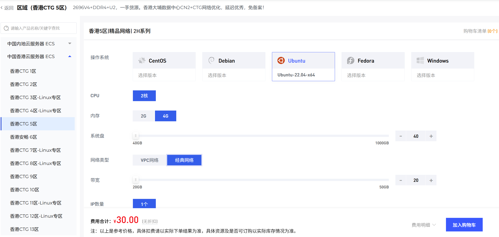
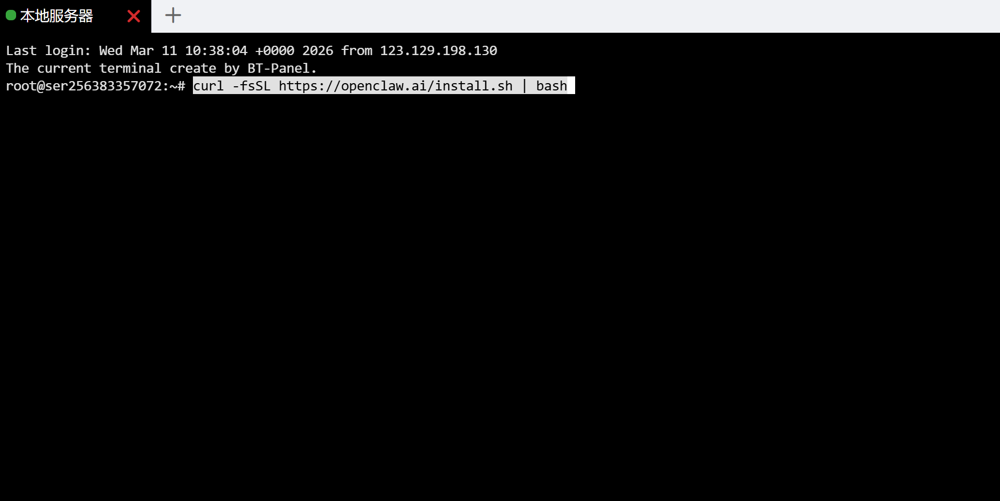
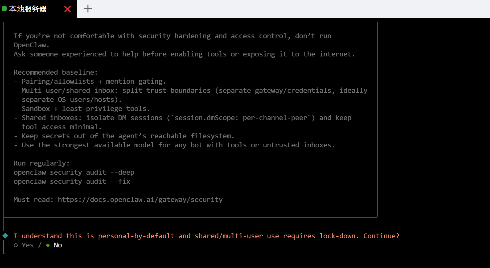
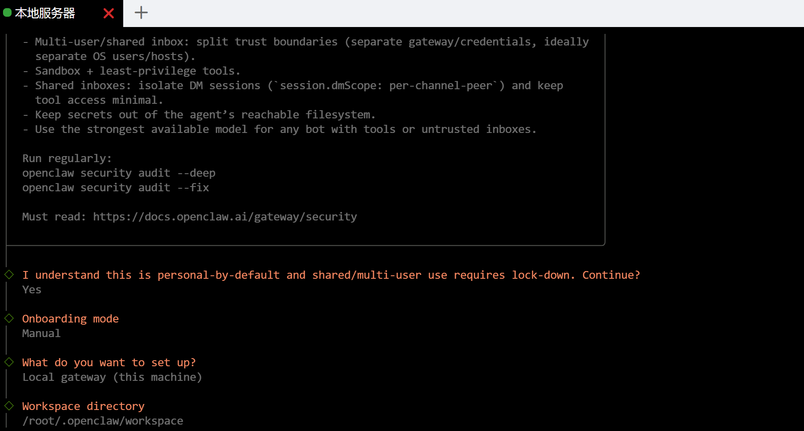
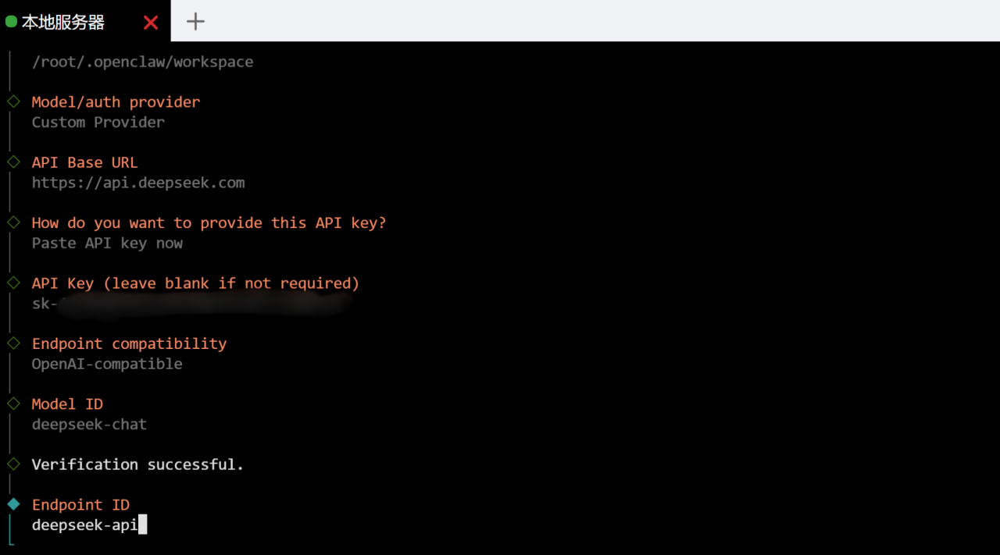
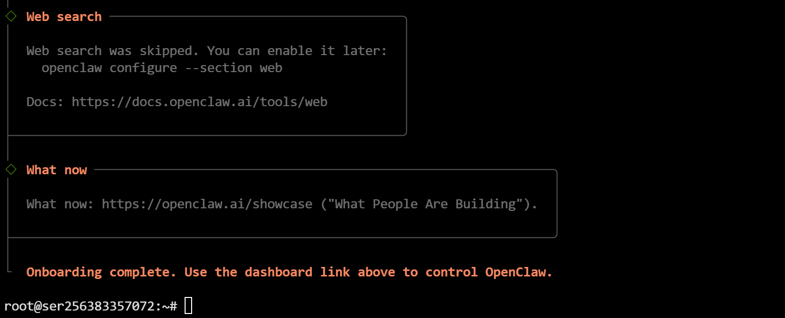
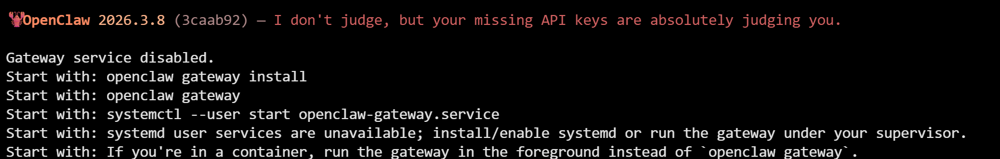
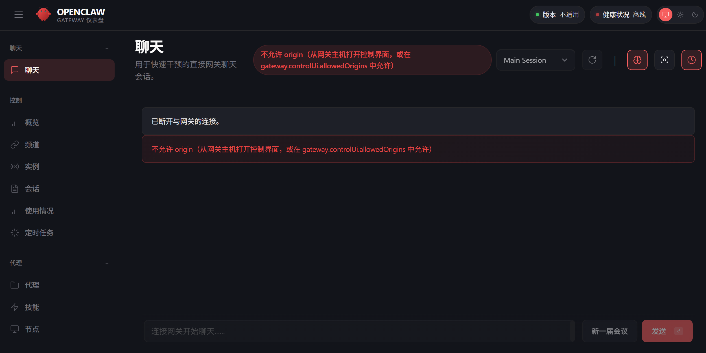
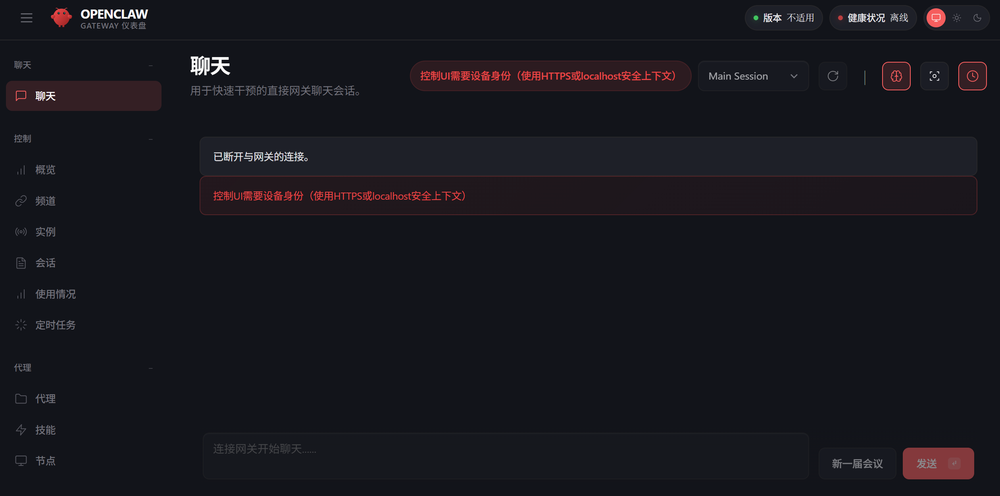
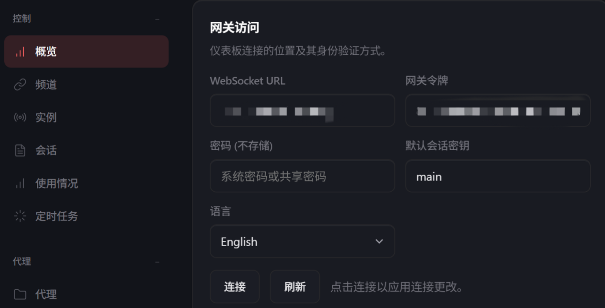

# 云服务器手动部署OpenClaw

## 一.我选择云服务器手动部署的原因

1. 相对于本地部署云服务器部署可以24小时运行，可以让它24小时帮我干活，彻底压榨AI的价值
2. 相对于本地部署无需折腾本地环境不用担心过高的权限搞崩电脑系统
3. 还有一个原因是大部分云厂商没有境外云服务器实例可以选择，这对于后续直连国外大模型受阻

## 二.购买云服务器

1. 狐蒂云服务器，价格实惠，选择众多，官方短信，邮件等信息通知比较完善，链接直达[狐蒂云官网](https://www.szhdy.com/aff/EKJAJGGB)
2. 注册并完成实名等基本信息后，依次选择订购产品-中国香港云服务器-香港CTG 5区-2H系列

> 推荐选择Ubuntu系统，兼容性高，选择2H4G，多Agent运行更加流畅，网络类型两个都可以无太大差别，系统盘默认40GB够用



3. 加入购物车后付款等待1-3分钟自动开通即可，成功后会分别收到付款成功通知和成功开通通知
4. 然后依次点击管理实例-云服务器ECS-管理，即可看到自己服务器的IP以及密码
5. 然后可以安装好宝塔面板可视化操作

## 三.安装openclaw

1. 打开宝塔面板终端，粘贴以下命令并执行，**注意：因为这是Linux操作系统，所以在终端时，粘贴的快捷键是ctrl+shift+v**

```shell
curl -fsSL https://openclaw.ai/install.sh | bash
```



2. 回车执行后耐心等待脚本自动安装即可，脚本会全自动安装，全程无需干预直到安装完成后会自动进入如下图所示的配置向导界面



3. 这句话的意思是：我理解这默认是个人使用场景，若用于共享 / 多用户场景则需要严格锁定安全配置。是否继续？我们直接通过键盘上的左右方向键选择yes然后回车



4. 然后接下来的几个选项按照我上方图片的展示选择即可，下一步进入到AI模型配置流程，这里依旧是键盘上下方向键选择**Custom Provider**进行自定义模型的配置，我这里用的是DeepSeek作为默认模型，后面是可以改的，如果没开始使用DeepSeek开放平台，可以前往[DeepSeek开放平台](https://platform.deepseek.com)获取你的API Key



5. DeepSeek开放平台的API Base URL是**https://api.deepseek.com**API Key填入你自己获取的密钥，Endpoint ID相当于是给你的这个自定义模型取个代号（备注）可以默认，Model alias是给模型取一个别名，其他均保持一致，出现Verification successful则表示模型连接成功，如果是其他模型则根据实际填写API Base URL，API Key和Endpoint compatibility（模型提供商类型）
6. Gateway port是网关运行端口，默认18789，Gateway bind选择LAN模式，可以公网访问，Gateway token (blank to generate)这个直接回车即可让系统自动生成随机的令牌即可,然后到下面的配置

- Configure chat channels now?——选择no,暂时跳过聊天渠道的配置，openclaw本身未提供QQ机器人的接入，后续再安装插件进行QQ机器人的接入
- Search provider——选择Skip for now，暂时跳过配置搜索功能，后续在配置文件中配置即可现在主要让openclaw可以跑起来
- Enable hooks?——空格键选择Skip for now，不启用插件，后续一样在配置文件中修改添加即可
- Enable zsh shell completion for openclaw?——这个选择什么都无所谓



7. 最后这样就是完成了官方的引导配置，上面会输出你的web ui访问的地址，格式如下，注意:这里的localhost是针对你服务器的本地而不是你的电脑的本地所以暂时还无法进行web端的访问，并且现在网关是处于未启动的状态

> localhost:18789/#token=系统给你生成的访问令牌

## 四.接入QQ机器人

1. 前往[openclaw专属QQ开放平台](https://q.qq.com/qqbot/openclaw/index.html)注册并创建自己的机器人
2. 然后在宝塔面板终端依次执行腾讯官方提供的三条命令即可，执行完成第二条命令成功之后会输出Added QQ Bot account "default"



3. 执行**openclaw gateway restart**这个命令重启本地OpenClaw服务的时候会出现如上报错，这是因为当前网关服务处于未安装未启动的状态，并且系统给出了启动建议，我们不走系统这个建议，根本没用，这个不支持root用户，而且正是失败的原因，直接按照下方教程在前台先启动网关，测试第一次连通先就行，成功了再继续往下改为后台启动的方案，终端依次执行命令即可

```shell
# 1. 先杀掉可能存在的旧进程
pkill -f openclaw-gateway

# 2. 启动 Gateway
nohup openclaw gateway run --port 18789 > /tmp/openclaw.log 2>&1 &

# 3. 验证是否运行成功
ss -tlnp | grep 18789
```

4. 执行 `ss -tlnp | grep 18789`命令后有**LISTEN**输出即为启动成功,然后可以去QQ给他打个招呼它就会回复了

## 五.配置网关后台运行+开机自启动

1. 创建启动脚本，宝塔面板左侧——文件——根目录——找到root文件夹——双击进入root文件夹——新建文本文件命名为start-openclaw.sh，双击打开start-openclaw.sh文件进行编辑，粘贴以下内容

```shell
# 告诉系统这是一个 bash 脚本
#!/bin/bash

# 设置环境变量（API 密钥）
export DEEPSEEK_API_KEY=你的实际密钥

# 后台启动 OpenClaw
nohup openclaw gateway run --port 18789 > /tmp/openclaw.log 2>&1 &
```

2. 宝塔面板终端执行以下命令，给脚本添加执行权限

```shell
chmod +x /root/start-openclaw.sh
```

3. 设置开机自启，在宝塔终端继续执行以下命令

```shell
crontab -e
```

4. 然后会有个数字1-4的选择，这是编辑crontab文件的命令，首次使用会问你选择编辑器，输入 1 然后回车
5. 在打开的文件的末尾粘贴这一行`@reboot /root/start-openclaw.sh`
6. 然后按 Ctrl + O 保存**（注意：是字母O不是数字0）**然后按enter确认保存，最后按Ctrl + X 退出
7. 然后首次需要自己手动启动，依次执行以下命令即可，**注意：一定要等待五秒钟，不然没有停止openclaw进程那么快，导致无法启动成功，已经栽过跟头了**

```shell
# 停止现在的openclaw
pkill -f openclaw-gateway

# 等待五秒钟

# 重新启动
/root/start-openclaw.sh

# 查看端口状态，如果显示 LISTEN，说明正在运行，即成功
ss -tlnp | grep 18789
```

8. 然后关闭宝塔面板终端，打开QQ对话给它发信息就可以看见它依旧可以在线回复了
9. 关于后续更新模型或者添加新的模型信息后，启动脚本中的环境变量写法规则

```shell
# 第一个
export 名字_API_KEY=你的实际密钥

# 第二个
export 名字_API_KEY=你的实际密钥
```

## 六.配置可访问web UI

1. 现在打开web UI的访问地址将localhost换成服务器的IP之后进行访问会显示断开与网关的连接，如下图，这是因为配置文件的allowedOrigins里没有允许外网访问的来源



2. 所以在配置文件里面允许外来的访问来源即可，如下

- 宝塔面板打开配置文件，路径/root/.openclaw/openclaw.json，找到gateway字段，添加"\*"允许所有来源就行

```json
//原代码
"gateway": {
    "port": 18789,
    "mode": "local",
    "bind": "lan",
    "controlUi": {
      "allowedOrigins": [
        "http://localhost:18789",
        "http://127.0.0.1:18789"
      ]
    },

//修改为
"gateway": {
    "port": 18789,
    "mode": "local",
    "bind": "lan",
    "controlUi": {
      "allowedOrigins": [
        "http://localhost:18789",
        "http://127.0.0.1:18789",
        "*"  //添加了这一个，后面配置了域名和反向代理后可以改为https://你的域名来增加安全性
      ]
    },
```

3. 保存文件后，重启网关服务，刷新前端页面即可看到新的报错信息如下图，添加站点配置反向代理然后添加SSL证书，重启网关服务即可解决



4. 然后看见缺少网关令牌的提示，这是因为新浏览器或者设备连接到Control UI时，Gateway 即使你们在同一个Tailnet上也需要进行配对批准，这是官方的安全措施



5. 在配置文件auth字段中复制自己的token信息，然后web页面侧边栏选择概览，粘贴在网关令牌然后点击下方的连接，然后在终端粘贴这个命令查看待配对的ID

```shell
openclaw devices list
```

6. 终端输出后，**pending**下**Request**下方的就是你要同意配对的ID，然后执行openclaw devices approve 就可以配对成功，将替换成自己的实际ID就行了，然后回到控制页面就可以看见完全正常了

## 七.常用命令汇总

```shell
# openclaw官方安装脚本命令
curl -fsSL https://openclaw.ai/install.sh | bash

# 停止openclaw相关的所有进程
pkill -f openclaw-gateway

# 已有脚本后一键启动openclaw命令
/root/start-openclaw.sh

# 查看端口情况
ss -tlnp | grep 18789

# 查看待配对的设备ID
openclaw devices list

# 同意配对ID,将<RequestId>替换成实际ID
openclaw devices approve <RequestId>

# 拒绝配对ID
openclaw devices deny <RequestId>

# 移除已经配对的ID
openclaw devices remove <DeviceId>

# 检查当前openclaw版本
openclaw --version

# 更新到最新版本,建议更新，新版本会持续修复安全漏洞
npm install -g openclaw@latest
```
