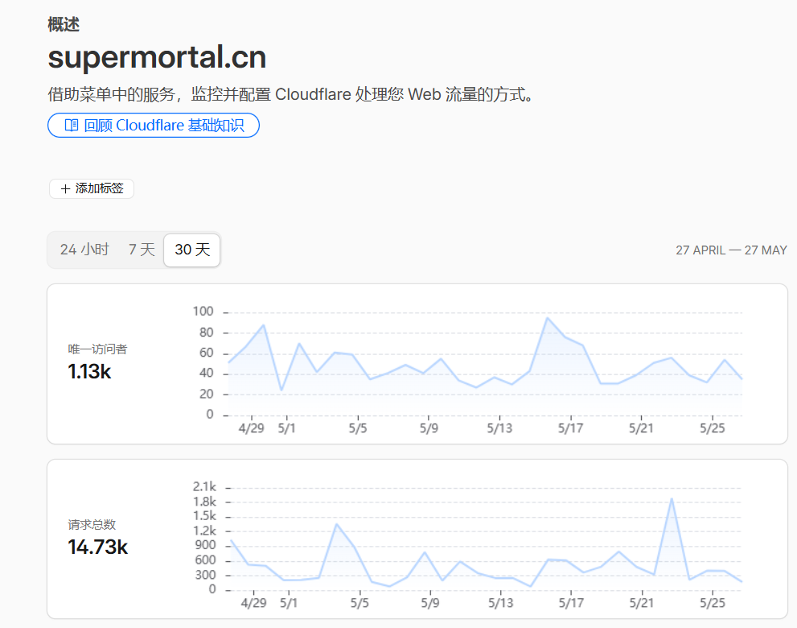

> **TL;DR**：本次 SEO 优化只做了一件事——给博客加上 JSON-LD 结构化数据。文章页自动输出 `BlogPosting`，首页自动输出 `WebSite`，以后发文无需手动维护

## 一.为什么要做这次优化

博客基于 Astro + astro-theme-pure，原本已经具备较完整的 SEO 基础：页面 title / description、Open Graph、Twitter Card、canonical 链接、sitemap、RSS、robots.txt 等。

但全站缺少 **JSON-LD 结构化数据**（`application/ld+json`）。

JSON-LD 是一段嵌在页面里的 JSON，用 Schema.org 标准告诉搜索引擎：

- 这是博客文章还是普通网页
- 标题、作者、发布时间分别是什么
- 站点名称和 URL 是什么

对 Google 富摘要、AI 搜索引用都有帮助。更重要的是：只要在布局里配置一次，**每篇新文章都会自动生成**，不用在 Markdown 里重复写。

## 二.我具体做了什么

### 1. 文章页：BlogPosting

新建组件 `src/components/BlogPostingJsonLd.astro`，在 `src/layouts/BlogPost.astro` 中挂载。

组件会读取文章 frontmatter 里已有的字段，自动拼出 JSON-LD：

| JSON-LD 字段           | 数据来源                                  |
| ---------------------- | ----------------------------------------- |
| `headline`             | frontmatter `title`                       |
| `description`          | frontmatter `description`                 |
| `datePublished`        | `publishDate`                             |
| `dateModified`         | `updatedDate`（没有则用 `publishDate`）   |
| `author.name`          | 站点配置 `config.author`                  |
| `image`                | `heroImage` 或默认 `socialCard`           |
| `mainEntityOfPage.@id` | `https://supermortal.cn/blog/{文章 slug}` |

最终页面 `<head>` 中会出现类似：

```html
<script type="application/ld+json">
  {
    "@context": "https://schema.org",
    "@type": "BlogPosting",
    "headline": "文章标题",
    "author": { "@type": "Person", "name": "Mortal" },
    ...
  }
</script>
```

### 2. 首页：WebSite

新建组件 `src/components/WebSiteJsonLd.astro`，在 `src/pages/index.astro` 中挂载。

自动读取 `site.config.ts` 里的站点名、描述、作者、语言，输出：

```html
<script type="application/ld+json">
  {
    "@context": "https://schema.org",
    "@type": "WebSite",
    "name": "super-mortal",
    "url": "https://supermortal.cn",
    ...
  }
</script>
```

### 3. 布局改造：head 插槽

JSON-LD 需要放在 `<head>` 里。为此改动了两个布局文件：

- `src/layouts/BaseLayout.astro`：在 `<head>` 中增加 `<slot name="head" />`
- `src/layouts/ContentLayout.astro`：把 `head` 插槽转发给 BaseLayout

文章页走 `BlogPost → ContentLayout → BaseLayout`，首页直接走 `BaseLayout`，两条路径都能把 JSON-LD 注入到 head

## 三.附 Cloudflare近一个月流量统计

